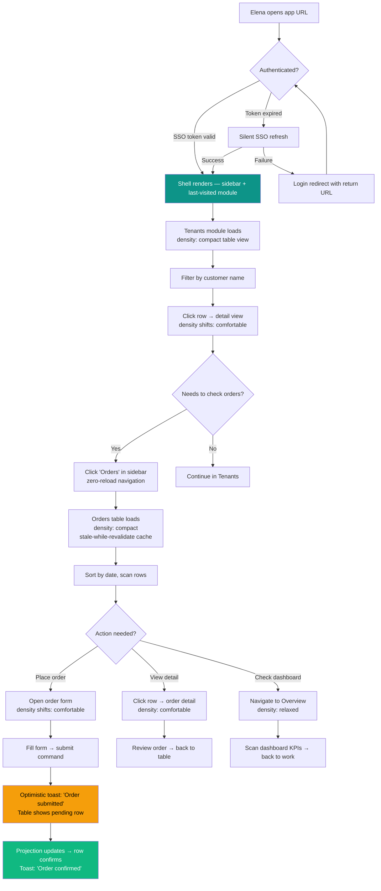
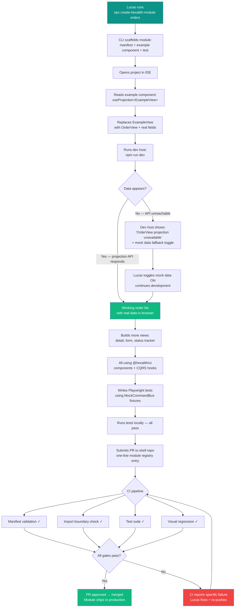
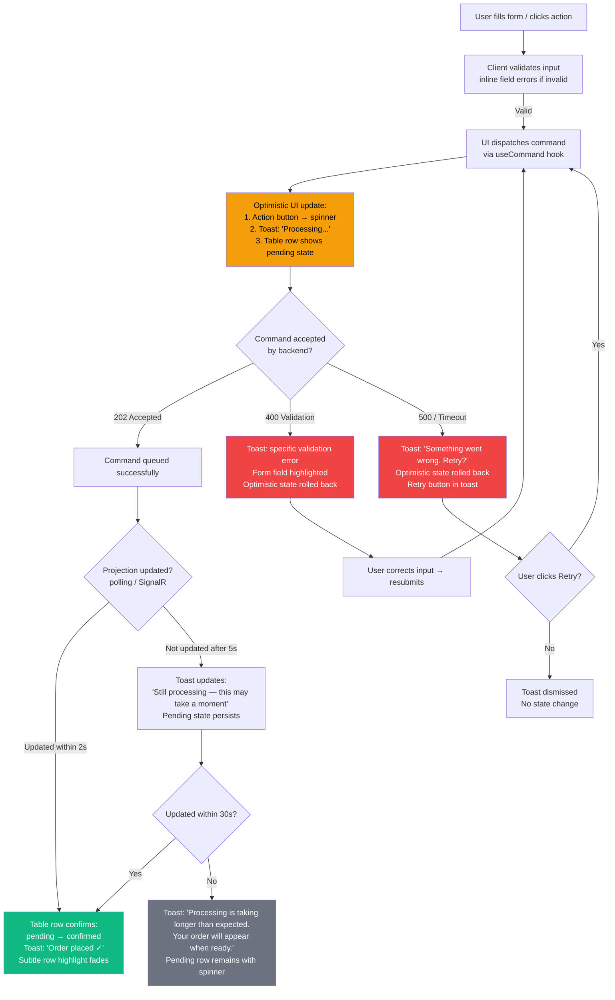
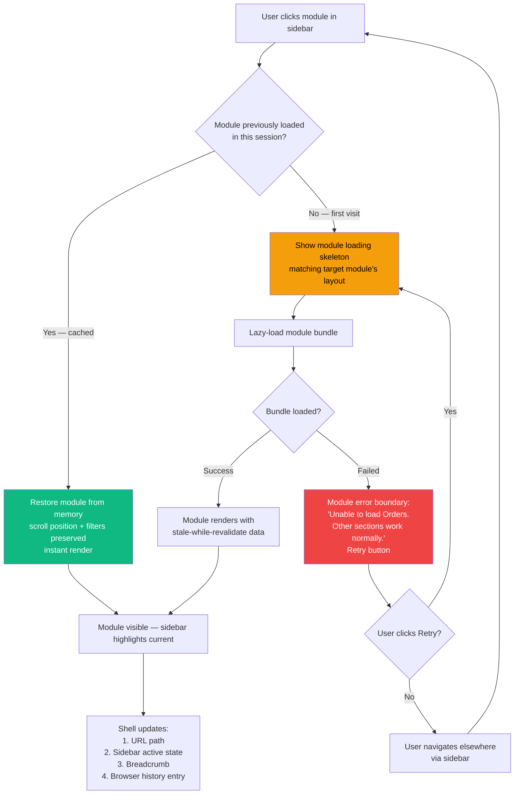
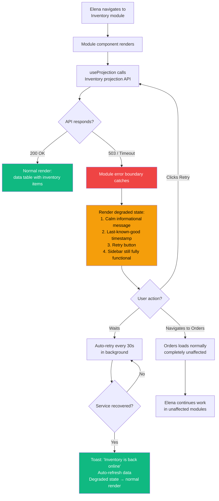

# UX Design Specification Hexalith.FrontShell

**Author:** Jerome
**Date:** 2026-03-11

---

## Executive Summary

### Project Vision

Hexalith.FrontShell is a Frontend Developer Platform with a dual-audience UX challenge. It is infrastructure that produces applications — the UX design must address two causally linked experience layers:

1. **Developer Experience (DX layer):** How module developers interact with the platform — CLI scaffolding, CQRS hooks (`useCommand`, `useProjection`), the `@hexalith/ui` component library, dev host, and testing patterns. The DX must make zero-infrastructure onboarding feel effortless.

2. **End-User Experience (UX layer):** How operations users interact with the composed output — a unified, beautiful application assembled from independently developed modules. The UX must be seamless, modern, and visually excellent.

The cascading quality model links these layers: DX quality directly determines UX quality. A well-designed component library makes every module beautiful by default. A poorly designed one multiplies inconsistency across every module. Aesthetic excellence is a first-class design goal — the composed application must feel premium, not utilitarian.

### Target Users

| Persona | Role | Primary Interaction | Design Priority |
|---------|------|-------------------|-----------------|
| **Lucas** (Module Developer) | Senior React/TS dev in a domain team | CLI, hooks, component library, dev host, manifest | API ergonomics, beautiful defaults, progressive complexity |
| **Jerome's Team** (Shell Team) | Platform maintainers | Shell application, package APIs, deprecation protocols | Maintainable design system, extensible patterns |
| **Elena** (End User) | Operations manager, non-technical | Unified app — navigation, tables, forms, dashboards | Visual consistency, information density, delight |
| **Priya** (Evaluator) | Skeptical team lead evaluating adoption | Scaffold as POC, migration cost assessment | Immediate visual impact, "this looks better than what we have" |
| **Ravi** (DevOps) | Platform operator | Deployment, monitoring, error telemetry | Minimal operational surface |

### Key Design Challenges

1. **Dual-audience coherence:** The component library must be beautiful for end users and ergonomic for developers. Every design decision faces the tension between visual polish and API simplicity — both must win.

2. **Enforced consistency at scale:** Beauty must be structural, not cosmetic. When 10+ module teams use `@hexalith/ui`, the system must make it nearly impossible to create ugly screens. Default spacing, typography, color, and layout must produce beautiful output with zero design effort from module developers.

3. **Graceful degradation aesthetics:** Error states, loading states, disconnection indicators, and partial failures must look intentional and designed — not like something broke.

4. **Information density balance:** Enterprise operations UIs need high information density without feeling cluttered. The design must respect screen real estate while maintaining visual breathing room for daily use.

5. **Cross-module visual seamlessness:** Navigation between modules must be invisible — same sidebar behavior, same table patterns, same form interactions, same micro-animations, zero visual seams.

### Design Opportunities

1. **"Beautiful by default" as competitive moat:** If `@hexalith/ui` produces stunning screens out of the box, module developers become advocates. The component library becomes the reason teams want to use FrontShell — transforming mandatory adoption into genuine pull.

2. **Modern enterprise aesthetic:** Most enterprise UIs look dated and utilitarian. FrontShell can establish a modern visual identity with subtle animations, thoughtful whitespace, refined typography, and a cohesive color system that makes daily work feel premium.

3. **Design system as AI advantage:** A well-defined, opinionated design system with strict component APIs makes AI generation produce visually excellent modules automatically — the AI doesn't need taste, it just follows the constraints. Beautiful + AI-generatable is a unique combination.

## Core User Experience

### Defining Experience

FrontShell's core experience operates across three dimensions, bridged by a single artifact — the `@hexalith/ui` design system.

**End User (Elena) — Core Loop:**
Sidebar navigation → data table → row detail → action (command) → feedback confirmation → back to table. This loop constitutes 90%+ of Elena's daily interaction — she processes 50 orders before lunch. If it feels seamless, beautiful, and fast, everything else follows. Speed and keyboard efficiency matter as much as aesthetics.

**Module Developer (Lucas) — Core Loop:**
Define TypeScript types → use CQRS hooks → compose with `@hexalith/ui` components → see it work. The "aha moment" is when `useProjection<OrderView>()` returns data and renders beautifully in a `<Table>` with zero configuration. When Lucas needs a custom component, design tokens ensure it inherits the system's beauty automatically.

**Power User (Elena at mastery) — Efficiency Loop:**
Ctrl+K → type action → execute → continue. The command palette gives instant access to any navigation, action, or search without touching the mouse. Keyboard shortcuts (Tab-Tab-Enter for forms, arrow keys for table navigation) eliminate friction for daily-use workflows.

**The Bridge:**
The `@hexalith/ui` design system is where DX meets UX. It is not a component library — it is a visual language delivered through components. Lucas writes `<Table data={orders} />` and Elena sees a beautiful, sortable, filterable data table. The design system absorbs all visual decisions. Developers configure behavior (columns, sorting, pagination) and express semantic intent (density, emphasis, state) — never appearance. The system maps intent to visuals. This is how beautiful + simple coexist without tension.

### A Day in the Shell

Elena opens the app Monday morning. The sidebar slides in — her pinned modules are right there: Tenants, Orders, Inventory. She hits Ctrl+K, types "ord," and she's in Orders before her coffee cools. The table loads instantly — rows of data appearing section by section, not all at once, not with a spinner. She clicks a row. The detail view slides into place, same layout as every other detail view she's ever seen in this app. She taps a status, confirms with Enter. A quiet toast confirms the update. She hits Escape, back to the table. The row already reflects the change — SignalR pushed it while she was reading the toast.

She switches to Inventory via the sidebar. No flash. No layout shift. Same sidebar, same top bar, same table behavior. She doesn't know this module was built by a different team. She doesn't know it was generated by AI last week. She doesn't care. It's just her app, and it's fast, and it's beautiful, and it respects her time.

This is the north star. Every design decision returns here.

### Platform Strategy

| Dimension | Decision |
|-----------|----------|
| Platform | Web application (React SPA), desktop-first with responsive support |
| Input mode | Mouse/keyboard primary (enterprise operations workstation); keyboard-first for power users |
| Navigation paradigm | Sidebar (collapsible/pinnable, grouped sections, favorites) + command palette (Ctrl+K). At 20+ modules, command palette becomes primary navigation. |
| Theme | Light and dark modes designed simultaneously with semantic color tokens. Never use raw color values. |
| Layout model | Shell controls chrome (sidebar, top bar). Modules control content area. MVP: standard layout only. Phase 2 manifest extension: `standard | full-width | custom`. |
| Component architecture | Radix Primitives for behavior (accessibility, keyboard, focus management) + custom design tokens and styled components for appearance. Full visual control with battle-tested interaction primitives. |
| Component discovery | Storybook as the living component catalog — prop tables, usage examples, design token reference. Serves both human developers and AI generation. |
| Responsive strategy | Desktop-first for MVP. Design tokens and component architecture support responsive evolution from day one (breakpoint tokens, touch-target tokens, responsive component behavior). No mobile-specific features in MVP, but no desktop-only assumptions baked into the design system. |
| Offline | Not required — CQRS commands need backend connectivity |
| Deployment | Static build (HTML/CSS/JS) served via containerized Nginx on Kubernetes. Frontend deployment is a static file swap — no connections to drain. |
| Real-time connection resilience | SignalR connections terminate at backend pods, not the frontend. **During backend rolling deployments:** backend pods drain active SignalR connections gracefully before termination. The shell's SignalR client detects disconnection, shows amber "Reconnecting..." in the status bar (2-5 seconds), auto-reconnects to a new pod, resubscribes to active projection channels, and applies missed updates via stale-while-revalidate cache. Elena sees a brief status bar flicker — no data loss, no page reload, no form state loss. |
| URL strategy | **Deep-linkable routes:** Every view has a shareable URL. Pattern: `/{module}/{entity}/{id}` (e.g., `/orders/detail/4521`). Tenant context is encoded in the auth session, not the URL — the same URL shows tenant-appropriate data based on the authenticated user's current tenant. Filter/sort state is encoded as URL search params (`?status=overdue&sort=date`) so Elena can share a filtered table view with a colleague. Browser back/forward navigation works as expected — shell router manages history entries. |
| Auth | OIDC (provider-agnostic via oidc-client-ts + react-oidc-context) — shell-managed, module-transparent |
| Infrastructure | DAPR-abstracted backend — frontend never references DAPR directly |
| Motion | `prefers-reduced-motion` respected globally; all transitions ≤ 200ms; motion communicates state, never decorates. Power-user motion reduction option. |
| CSS strategy | Scoped/layered styles — design system styles are unoverridable by module code. Lint rule flags `!important` in modules. |

### Effortless Interactions

#### MVP Interactions

1. **Hook-to-UI (Lucas):** Dropping `useProjection<T>()` into a component and having data appear — with loading states, error handling, and real-time updates — without writing a single line of plumbing code. The hook uses SignalR for real-time projection updates with an **automatic polling fallback** (configurable interval, default 5s) for environments where WebSocket connections are unavailable (corporate proxies, restricted networks). The fallback is transparent — module developers never configure transport. The three-phase feedback pattern works identically in both modes; only the confirmation latency differs.

2. **Cross-module navigation (Elena):** Switching between Tenants → Orders → Inventory and feeling like it's one perfectly designed application — zero visual or behavioral discontinuity.

3. **Real-time feedback (Elena):** Submitting a command (place order, create tenant) and seeing the projection update in real-time via SignalR — the data just appears, no manual refresh needed.

4. **Beautiful scaffold (Lucas):** Scaffolding a module and seeing a premium, custom-looking page in the browser before writing any code — not a generic template, but a showcase. The default scaffold screen includes a data table with sample projection data, a detail view, and a command form — all fully styled and interactive.

5. **Auth transparency (Lucas):** Authentication, token management, and tenant context are completely invisible. Modules never see tokens, never configure headers, never handle session state. **Token refresh is non-destructive:** silent SSO refresh happens in the background without navigation, page reload, or React tree remount. In-progress form data, scroll position, and component state survive token refresh. If silent refresh fails (session truly expired), the shell preserves form state in sessionStorage before redirecting to login, and restores it on return via the redirect URL's return path.

6. **Command feedback (Elena):** Every command produces clear feedback — success toasts, validation error highlights on specific fields, progress indicators for long-running operations. Elena always knows what happened and what to do next.

7. **Inline form validation (Elena/Lucas):** Forms validate inline as Elena types — required fields, format constraints, domain rules. Errors appear contextually on the field, not in a disconnected error banner. `@hexalith/ui` Form component handles this by default.

8. **Content-aware loading skeletons (Elena):** Loading states match the actual content layout — skeleton table rows, skeleton form fields, skeleton detail cards — not generic pulsing blocks. Loading looks intentional, like the content is arriving, not like something broke.

9. **Beautiful empty states (Elena/Lucas):** When there are no orders, no tenants, no data — Elena sees a designed, helpful state: illustration + message + action ("No orders yet. Create your first order."). Every module gets a consistent, beautiful empty state pattern from `@hexalith/ui`.

10. **Custom component integration (Lucas):** When `@hexalith/ui` doesn't have what Lucas needs, exported design tokens (CSS custom properties) ensure his custom third-party component inherits system spacing, typography, color, and motion — looking native without manual styling.

#### Future Interactions (Post-MVP)

11. **Command palette (Elena) — Phase 1.5:** Ctrl+K opens instant access to any navigation, action, or search. At 20+ modules, this becomes the primary navigation method — faster than any sidebar.

12. **Keyboard-first power workflows (Elena) — Phase 1.5:** Tab-Tab-Enter submits forms. Arrow keys navigate tables. Shortcuts for bulk operations. Power users never need the mouse for routine operations.

13. **Bulk operations (Elena) — Phase 2:** Multi-select table rows with Shift+Click or Select All, then apply bulk actions (status change, export, delete). Processing 47 orders means batch workflows, not one-at-a-time.

14. **Data export (Elena) — Phase 2:** Export any table view to CSV or print-friendly format. Elena generates weekly reports without leaving the application.

15. **Notification preferences (Elena) — Phase 2:** Elena controls notification behavior — toast duration, position. Shell-level preference, not a module concern.

16. **Integration preview (Lucas) — Phase 1.5:** Before merging, Lucas runs his module inside the full shell locally alongside other modules — not just the isolated dev host.

### Critical Success Moments

| Moment | Persona | Impact |
|--------|---------|--------|
| First scaffold renders in browser | Lucas | "This looks custom and premium — not another Material template" — instant platform credibility |
| Signature visual interaction in scaffold | Priya | "Wait, this is the scaffold?" — the go/no-go evaluation moment. Visual first impression decides adoption. |
| First `useProjection` returns real data | Lucas | "I didn't write any infrastructure code" — the anxiety dissolves, confidence begins |
| First cross-module navigation | Elena | "It all feels like one app" — architecture becomes invisible, trust established |
| First command feedback toast | Elena | "I always know what happened" — trust in the system's communication |
| First error boundary activation | Elena | "Something failed but the app still works" — resilience builds trust |
| First dark mode toggle | Elena | "They thought about my daily comfort" — attention to craft earns loyalty |
| First empty state encountered | Elena | "Even 'nothing here' looks intentional" — design quality is consistent everywhere |
| AI-generated module looks identical | Team Lead | "I can't tell which one the AI built" — generation becomes the default path |

### Experience Principles

1. **Beautiful and accessible by default:** Every component, layout, and state produces visually excellent, WCAG AA compliant output with zero design effort. Beauty and accessibility are inseparable — contrast ratios, focus indicators, and semantic HTML improve visual clarity. Beauty is structural, defined by four pillars:

   | Pillar | What It Controls | Design System Responsibility |
   |--------|-----------------|------------------------------|
   | **Spacing** | 4px base grid (8px preferred rhythm), consistent padding/margin rhythm | Every component uses the grid. No arbitrary values. |
   | **Typography** | Font family, scale, weight hierarchy, line height | One distinctive typeface, strict scale (6-8 sizes), weight encodes hierarchy |
   | **Color** | Palette, semantic tokens, surface/elevation system | Warm neutrals + one accent. Colors mean things. Light and dark themes from day one. |
   | **Motion** | Transitions, micro-animations, loading states | ≤ 200ms ease-out default. Motion communicates state, never decorates. `prefers-reduced-motion` respected. |

   The scaffold is a showcase, not a skeleton. A distinctive visual identity (non-default typeface, unique color temperature) ensures the output looks custom and premium.

2. **Invisible architecture:** End users never perceive module boundaries, loading seams, or infrastructure complexity. The composed application feels like a single, handcrafted product. Architecture success is measured by its invisibility.

3. **Progressive revelation:** Simple things are simple — `<Table data={items} />` just works beautifully. Complex things are possible — custom columns, row actions, virtual scrolling are there when you need them. The API surface grows with the developer's needs, never overwhelming upfront.

4. **Designed degradation:** Every failure state — loading, error, disconnection, partial failure, empty data — is as carefully designed as the happy path. Content-aware skeletons, helpful empty states, contextual error messages, and graceful timeouts all build trust. Degraded states are intentional, not accidental.

5. **Consistency is freedom:** Strict visual constraints at the shell level create freedom at the module level. Components expose semantic intent (density, emphasis, state), never visual properties (size, color, spacing). The design system maps intent to appearance. CSS isolation makes overrides technically difficult. Developers focus on domain decisions; the system handles all visual decisions.

6. **Respect the user's time:** Every animation, confirmation dialog, and extra click costs Elena seconds. Over 8 hours, seconds become minutes. The system is relentless about eliminating unnecessary steps — no confirmation dialogs for reversible actions, no loading spinners that could be skeletons, no multi-step wizards for single-concept operations. Tempo matters as much as aesthetics.

### Signature Interaction (Design Decision Required)

The scaffold needs one visual moment that makes evaluators say "wait, this is the scaffold?" — a signature that communicates design quality instantly. This is a concrete design decision to make during component development. Candidates:

- **Smooth page transitions** between routes with content crossfade
- **Table sorting animations** — rows physically reorder with fluid motion
- **Loading skeleton → content reveal** — content fades in section-by-section as data arrives
- **Sidebar navigation indicator** — active item with smooth sliding highlight
- **Form field focus** — refined focus ring animation with subtle elevation change

The chosen signature must be: ≤ 200ms, `prefers-reduced-motion` compatible, and present in every module by default (not opt-in).

### Design Risk Mitigations

| Risk | Prevention |
|------|-----------|
| **Style leakage and overrides** | CSS layers/scoping make design system styles unoverridable by module code. Lint rule flags `!important` in modules. |
| **Generic template appearance** | Invest in distinctive visual identity before building components — non-default typeface, unique color temperature, signature interaction. Identity lives in tokens, not components. |
| **Beauty that slows daily use** | All transitions ≤ 200ms. `prefers-reduced-motion` respected globally. Power-user motion reduction option. |
| **Dark mode as afterthought** | Design light and dark themes simultaneously. Semantic color tokens map to both themes from day one. Never use raw color values. |
| **Design system stagnation** | Component contribution pipeline — module teams propose components to `@hexalith/ui` with clear acceptance criteria and fast review cycle. |
| **Custom component visual drift** | Exported design tokens (CSS custom properties) so third-party and custom components inherit system spacing, typography, color, and motion. |
| **Sidebar collapse at scale** | Grouped sections, collapsible categories, favorites/pinning. Command palette as primary navigation at 20+ modules. |
| **Content-unaware loading** | Content-aware skeletons mandatory — skeleton table, skeleton form, skeleton detail. Generic pulsing blocks forbidden. |
| **Empty state neglect** | `@hexalith/ui` provides a standard EmptyState component with illustration + message + action CTA. Every data view requires an empty state. |
| **Feedback silence after commands** | Notification system built into shell. Every command produces visible feedback — success, validation error, or progress. No silent failures. |
| **Scope creep in MVP** | Effortless interactions explicitly triaged into MVP vs. Future. Command palette, bulk operations, data export, and notification preferences are post-MVP. |

### Build Strategy: Tokens and Interfaces Together

Design tokens and code interfaces ship together in Week 1 — they are both foundational contracts. The spacing scale, typography scale, color palette (light + dark), and motion curves are defined alongside `ICommandBus`, `IQueryBus`, and `ModuleManifest`. This ensures the scaffold in Weeks 3-4 immediately looks premium because the visual identity already exists.

**Build order:**
1. **Week 1:** Design tokens + code interfaces (visual contract + code contract, together)
2. **Weeks 2-3:** Core layout components consuming tokens + scaffold CLI
3. **Weeks 3-4:** Interactive components consuming tokens + reference module
4. **Ongoing:** Storybook documentation grows with each component

The same tokens drive the web application, Storybook, AI generation prompts, and print/export stylesheets. Single source of visual truth.

Token compliance scan tooling (PostCSS/Stylelint plugin) is part of the Week 1 token deliverable, not a follow-up. The enforcement infrastructure and the design tokens are a single artifact.

## Desired Emotional Response

### Primary Emotional Goals

| Persona | Primary Emotion | Expression |
|---------|----------------|------------|
| **Elena (End User)** | **Quiet confidence** | "This tool respects me — it's fast, clean, and never gets in my way" |
| **Elena (Long Session)** | **Sustained comfort** | "After 4 hours, the interface still feels restful — nothing screams for attention" |
| **Lucas (Developer)** | **Authorship within constraints** | "I shaped this module — the system made it beautiful, but the decisions are mine" |
| **Lucas (Returning)** | **Familiar mastery** | "Six months later, I still know exactly how this works" |
| **Priya (Evaluator)** | **Immediate credibility** | "I screenshotted the scaffold, sent it to Slack, and three engineers asked what tool this is" |
| **Jerome's Team (Shell)** | **Trust in the system** | "Every module that ships looks right because the system makes it structurally impossible not to" |

The unifying emotional thread: **visual quality as trust signal**. A good-looking, responsive, clean UI tells every persona the same thing — this platform is serious, maintained, and worth investing in. Aesthetic excellence is not decoration; it is the primary mechanism for building trust across all audiences.

**Temporal framing:** Beauty dominates the **acquisition moment** (screenshot, first impression, evaluation decision). Responsiveness dominates the **retention moment** (daily use, long sessions, muscle memory). Both are non-negotiable — they serve different lifecycle stages. Predictability is a form of responsiveness: learned muscle memory must not be disrupted by "delightful" variations.

### Core Emotional Definitions

The three emotional keywords — **good looking, responsive, clean** — are the emotional specification. Their meaning is precise:

| Word | Emotional Definition | Common Misinterpretation | Operational Interpretation |
|------|---------------------|-------------------------|---------------------------|
| **Good looking** | **Visual coherence** — every element belongs to the same system. Zero visual orphans, zero contradictions. Beauty is the absence of inconsistency, not the presence of flair. | "Distinctive typeface and unique colors" (those help, but coherence is the foundation) | Programmatic token compliance: zero non-system colors, zero spacing violations, zero typographic orphans. |
| **Responsive** | **Causal clarity** — the user always understands what the system is doing in response to their action. "I caused that" matters more than "that was fast." | "Fast transitions and low latency" (speed serves causal clarity, not the reverse) | Sub-100ms input acknowledgment, ≤ 200ms transitions with spatial continuity, zero unacknowledged user actions. |
| **Clean** | **Signal-to-noise ratio** — every visible element carries information or aids navigation. Nothing is purely decorative. | "Lots of whitespace" (whitespace is a tool for signal clarity, not a goal) | **Legibility at speed** for data-heavy screens: Elena finds the anomaly in 50 rows within 2 seconds. Emphasis patterns, data formatting, and scannable visual alignment matter more than spacing minimalism. |

### Token-to-Emotion Mapping

Each emotional goal traces to specific token decisions:

| Emotional Goal | Token Category | Specific Decisions | Measurable Target |
|---------------|---------------|-------------------|-------------------|
| **Visual coherence** | Color palette | Warm neutral base, single accent hue, semantic color tokens only | 0 non-system colors in any module; token compliance score = 100% |
| **Visual coherence** | Typography | One distinctive typeface, strict scale (6-8 sizes), weight encodes hierarchy | 0 font-size values outside the scale; 0 raw `px` font declarations in modules |
| **Causal clarity** | Motion | Ease-out curves, spatial origin/destination for transitions | All transitions ≤ 200ms; all input acknowledgment ≤ 100ms |
| **Signal clarity** | Spacing | 4px base grid (8px preferred rhythm), consistent padding/margin rhythm | 0 spacing values outside the grid; programmatic grid compliance score = 100% |
| **Sustained comfort** | Color (secondary) | `--color-text-secondary` at 4.5:1 contrast (not 7:1); `--color-text-tertiary` at 3:1 for non-essential labels | Measured luminance ratios per token; long-session fatigue reduction validated |
| **Quiet delight** | Motion (signature) | Sidebar highlight slide, content reveal, sort animation | Duration ≤ 200ms; `prefers-reduced-motion` disables all; unprompted descriptor test passes |
| **Dark mode belonging** | Color (dark theme) | Parallel dark palette designed from scratch, not inverted | Every screen passes all validation tests in both themes |

### Emotional Registers

The interface is not a single emotional temperature. It shifts contextually across four registers:

| Register | When Active | Visual Characteristics | Example |
|----------|-----------|----------------------|---------|
| **Quiet** | Idle browsing, background monitoring, no pending actions | Muted secondary info, low contrast non-essentials, minimal motion, visually restful | Elena scanning a table with no urgent items |
| **Neutral** | Active work, standard interaction flow | Full contrast hierarchy, standard transitions, clear affordances | Elena clicking through order details, Lucas composing components |
| **Assertive** | Important feedback, state changes, successful completions | Accent color prominence, toast notifications, confirmation micro-animations | Command success toast, status change confirmation |
| **Urgent** | Critical alerts, errors, deadline warnings, connection loss | High-contrast warning colors, persistent (not auto-dismissing) indicators, elevated visual weight | Backend disconnection banner, validation errors on submit |

The design system provides semantic tokens for each register. Components shift registers based on application state — module developers express intent ("this is urgent"), the system handles the visual expression.

### Emotional Journey Mapping

| Stage | Elena (End User) | Lucas (Developer) |
|-------|-----------------|-------------------|
| **First encounter** | "This looks modern and clean — not like the enterprise tools I'm used to" | "The scaffold looks like a shipped product, not a template — I trust this platform" |
| **Core action** | "Everything responds to me — I caused that, and I can see it" | "I composed three components and the page looks like I had a designer" |
| **Long session (4+ hours)** | "The interface is restful — muted secondary info, nothing demanding attention I didn't ask for" | "Adding the fifth feature today still feels smooth — the API is predictable" |
| **Task completion** | "I processed 50 orders and the experience felt effortless and crisp" | "I shipped a feature and the PR reviewer asked who did the design" |
| **Error / failure** | "Something went wrong but the app handled it gracefully — still feels solid and intentional" | "My custom component doesn't match the system — but the diagnostic told me exactly what's wrong: 'uses 14px; system uses --font-size-body: 0.875rem.' Frustration became resolution in 10 seconds." |
| **Constraint tension** | *(not applicable — Elena doesn't see constraints)* | "I wanted to change the color but couldn't. Then I realized I could change emphasis, density, and layout — and that's actually more expressive than picking colors. The constraint is a creative tool." |
| **Daily return** | "Opening this app is a clean, fast, reliable start to my workday" | "Adding features to my module feels like extending a well-designed product" |
| **Mastery** | "I'm fast because the interface is predictable and keyboard-friendly" | "I know the component API well enough to build complex UIs that still look right" |
| **Returning after months** | "Everything is where I remember — the patterns stuck" | "Six months later, I opened this module and immediately knew how to modify it" |

### Emotional Validation Gates

Three non-negotiable gates tell a complete story about emotional design commitment: Beauty → System → Purpose.

**Non-Negotiable MVP Gates:**

| Gate | Story | Protocol | Automation |
|------|-------|----------|------------|
| **1. The Slack Test** (Beauty) | "Does it look like a real product?" | Post TWO scaffold screenshots to 5 engineers with no context: (A) a default MUI or Ant Design scaffold of the same Orders table, (B) the FrontShell scaffold. Do not label which is which. Pass: 3+ identify FrontShell as "the real product" or ask "what tool is B?" Bundled glance test: "What's the primary action on screenshot B?" — 4/5 answer correctly in 3 seconds. The baseline comparison makes the test objective — it measures the *delta*, not an absolute. | Manual, 15 minutes. Run before first module ships. |
| **2. Token Compliance Scan** (System) | "Is it structurally incapable of being ugly?" | Automated CI gate on every module PR. Validates all values against design token registry. Produces visible compliance score (100% = pass, percentage shown in every PR). | Fully automated — PostCSS/Stylelint plugin built in Week 1 alongside tokens. |
| **3. Task Completion Test** (Purpose) | "Does beauty serve the user's actual work?" | Elena-persona processes an order end-to-end. Baseline measured pre-FrontShell. Target: faster than baseline with zero hesitation. | Semi-automated (scripted task, human observer). Run before production deployment. |

**Recommended Practices (valuable but not blocking):**

| Method | What It Validates | Notes |
|--------|------------------|-------|
| **Glance test** | Perceptual hierarchy | Bundled into Slack test protocol |
| **Dual-theme parity** | Dark mode quality | Partially automated by token compliance scan; manual review for perceptual parity recommended |
| **Token freeze screenshot** | Token visual quality | Subsumed by Slack test |
| **Cross-module seam test** | Module boundary invisibility | Post-launch; quarterly UX validation |
| **Unprompted descriptor analysis** | Perceived emotional quality | Post-launch; quarterly UX validation |
| **Production-volume emotional test** | Feelings at real data scale | Post-launch; before each major release |
| **Long-session observation** | Sustained comfort | Post-launch; quarterly UX validation |
| **Returning user test** | Familiar mastery after absence | Post-launch; 6-month validation |
| **Coherence arbiter review** | Programmatic contradiction detection | Post-launch; integrated into token compliance tooling evolution |

### Micro-Emotions

**Critical (non-negotiable):**

| Micro-Emotion | Target State | Anti-State to Prevent | Quantified Metric |
|---------------|-------------|----------------------|-------------------|
| **Visual coherence** | "Every element belongs here" | "That button looks different from the others" | Token compliance score = 100%; 0 non-system colors; 0 spacing violations |
| **Causal clarity** | "I caused that, and I can see the result" | "Did my click register? Is it loading?" | Input acknowledgment ≤ 100ms; 0 unacknowledged user actions |
| **Signal clarity** | "I can find what I need without scanning" | "Everything is crammed" or "Everything is spread too thin" | Elena finds anomaly in 50-row table within 2 seconds (legibility at speed) |
| **Consistency comfort** | "I already know how this page works" | "Every screen feels different" | Cross-module seam test pass rate = 100% |
| **Sustained comfort** | "After hours of use, the interface still feels restful" | "Everything is demanding my attention equally" | Long-session descriptor: "restful" not "tiring" at 2+ hours |

**Aspirational (design differentiators):**

| Micro-Emotion | Target State | Design Lever |
|---------------|-------------|-------------|
| **Quiet delight** | The user *feels* the transition but doesn't *notice* it | Signature micro-interactions. **Delight threshold: felt-not-noticed.** If a user comments on an animation, it's too much. If "smooth" appears in unprompted descriptors, it's right. |
| **Craftsmanship recognition** | "Someone cared about the details" | Typography hierarchy, icon consistency, hover states, focus rings — the 1% details that separate "clean" from "premium." |
| **Authorship** | "I shaped this, even though the system handled the visuals" | Component APIs that let developers make meaningful configuration choices (column order, density, emphasis) — decisions that feel like design decisions, not just data binding. |
| **Dark mode belonging** | "They thought about how I actually work" | Parallel dark palette designed from scratch. **Dual-theme parity is mandatory.** |
| **Boredom resistance** | "This never feels monotonous, even on the 200th use" | Subtle visual variety within consistency — bounded to three specific mechanisms: **(1) Contextual empty states** — each module has a unique illustration and domain-aware message (Orders shows an invoice sketch, Inventory shows a warehouse shelf), drawn from a shell-team-approved illustration set. **(2) Data-driven density shifts** — a table with 3 rows feels spacious, a table with 80 rows tightens row height automatically via the `<Table>` density-responsive behavior. **(3) Time-contextual greetings** — the status bar optionally shows "Good morning, Elena" on first load of the day, disappearing after 5 seconds. No other variety mechanisms permitted — this list is exhaustive to prevent module teams from interpreting "variety" as creative license. |

### Enforcement Zones

Visual coherence enforcement operates across three zones, each with an expected emotional outcome:

| Zone | Scope | Enforcement Level | Expected Emotion |
|------|-------|-------------------|-----------------|
| **Zone 1: Inside `@hexalith/ui`** | Component internals — spacing, color, typography, motion | Fully enforced. Zero escape hatches. Tokens are the only input. | **Confidence** — "I can't make this ugly even if I try" |
| **Zone 2: Module code** | Developer-authored layouts, compositions, custom components using design tokens | Lint-enforced. Token compliance scan in CI. Overridable with effort but flagged. | **Guidance** — "The system nudges me toward coherence with helpful suggestions" |
| **Zone 3: Third-party libraries** | Charting libraries, rich text editors, external widgets that inject their own styles | Unenforceable. Contained by component boundaries. Exported tokens available for voluntary adoption. | **Acceptance** — "The system does its best, and the boundary is honest" |

### Design Implications

| Emotional Goal | UX Design Approach |
|---------------|-------------------|
| **Good looking (visual coherence)** | Distinctive visual identity defined at the token level: non-default typeface, warm neutral palette with one accent color, refined typography scale. Identity lives in 12-15 token decisions, not 200 component decisions. The scaffold must pass the screenshot test before any module ships. |
| **Responsive (causal clarity)** | Sub-100ms input acknowledgment. Transitions ≤ 200ms ease-out with spatial continuity (content moves *from somewhere to somewhere*). Content-aware skeleton loading (not spinners). Optimistic UI updates for commands. Every user action produces visible, immediate, spatially coherent feedback. |
| **Clean (signal-to-noise / legibility at speed)** | 8px spacing grid with no exceptions. Typography weight and size create hierarchy — not color, not borders. Emphasis patterns and data formatting optimized for scanning speed. Every visible element carries information or aids navigation — nothing is purely decorative. |
| **Sustained comfort** | Muted secondary information via calibrated luminance ratios (`--color-text-secondary` at 4.5:1, `--color-text-tertiary` at 3:1). No attention-competing animations on idle screens. Notification toasts auto-dismiss. The visual volume turns down for elements the user isn't actively engaging with. |
| **Error grace** | Errors look designed — contextual messages on the field that failed, not disconnected banners. Developer-facing: diagnostic feedback with specific token references ("uses 14px; system expects --font-size-body"). Nothing ever looks "broken." |
| **Cross-module seamlessness** | CSS scoping makes visual override structurally impossible within `@hexalith/ui` components. Enforcement boundary: guaranteed inside `@hexalith/ui`; best-effort outside via exported tokens. Third-party libraries that inject styles are contained but not prevented — this is an honest limitation. Lint-time enforcement flags `!important` and non-token values in module code. |

### Conflict Resolution

When emotional goals collide, **signal clarity wins all conflicts.**

| Conflict | Resolution | Rationale |
|----------|-----------|-----------|
| Calm layout vs. information density | Density wins | Elena needs to scan 50 orders. Calm is a means to signal clarity, not an end. |
| Animation smoothness vs. interaction speed | Speed wins | Muscle memory depends on predictable timing. A learned flow must not be disrupted by delight. |
| Visual distinctiveness vs. accessibility contrast | Accessibility wins | Contrast ratios are token constraints, not post-launch fixes. WCAG AA compliance improves visual clarity for everyone. |
| Developer expressiveness vs. system coherence | Coherence wins, with redirect | Developers cannot override tokens. But they can configure emphasis, density, layout, and behavior — creative agency through semantic intent, not visual property control. |

### Emotional Design Principles

1. **The screenshot test is literal.** Every screen, in every state (loading, empty, error, populated, light, dark), must pass the Slack test, the glance test, and the seam test. These are design review gates, not aspirations.

2. **Responsive means "I caused that."** The interface shows causal links between user actions and system responses. Transitions show spatial continuity. The absence of causal clarity is the primary emotional anti-pattern.

3. **Clean is legibility at speed.** Signal-to-noise ratio optimized for scanning. A dense table with zero decoration is cleaner than a sparse page with gradients. For data-heavy screens, the question is: can Elena find the anomaly in 2 seconds?

4. **Beauty that compounds.** Token-driven aesthetics ensure the 50th module is as beautiful as the 1st. Beauty is additive, not dilutive.

5. **Delight is felt, not noticed.** If a user comments on an animation, it's too much. If they describe the app as "smooth" unprompted, it's right.

6. **Dual-theme parity.** Every emotional goal is validated in both light and dark themes simultaneously. Dark mode is a parallel design with equal craft.

7. **Signal clarity wins all conflicts.** When emotional goals collide, the option that improves Elena's ability to find, read, and act on information wins.

8. **Feelings over features.** When a design decision is ambiguous and signal clarity doesn't resolve it, choose the option that produces a better emotional response.

9. **Accessibility is a token constraint.** Contrast ratios and semantic HTML are designed into tokens, not audited post-implementation.

10. **The interface has registers.** Quiet for idle, neutral for work, assertive for feedback, urgent for alerts. Emotional temperature shifts contextually — the UI is not a single mood.

11. **Enforcement speaks in guidance, not punishment.** Lint errors and build warnings use helpful, redirecting language: "Try `--emphasis-high` instead of custom color — here's what it looks like" not "FORBIDDEN: non-system color." The emotional redirect from constraint tension happens in the error message copy. Punitive language creates resentment; guidance language creates learning.

12. **Honest enforcement boundaries.** Visual coherence is guaranteed inside `@hexalith/ui` components and best-effort outside via exported tokens. The spec acknowledges where the guarantee ends rather than promising what it can't enforce.

### Emotion-Specific Risks

*Note: General design risks (token compromise, override creep, dark mode afterthought, content-unaware loading, etc.) are covered in the Design Risk Mitigations section above. The following are additional risks specific to emotional design goals.*

| Risk | Prevention |
|------|-----------|
| **Screenshot vanity** — teams optimize for static beauty, masking interaction dysfunction | Task completion test as mandatory companion to screenshot test |
| **Delight creep** — micro-animations accumulate until the UI feels over-designed | Delight threshold principle + unprompted descriptor analysis; "animated" in descriptors triggers review |
| **Emotional monotone** — single restful register applied everywhere, including situations that need urgency | Four defined emotional registers with semantic tokens; urgent states tested for visibility and attention capture |
| **Constraint resentment** — developers feel creatively limited, not creatively redirected | Explicit constraint tension design in emotional journey; component APIs expose meaningful configuration choices (emphasis, density, layout); guidance copy in lint errors |
| **Coherence subjectivity** — "looks right" is debated endlessly without resolution | Coherence arbiter: programmatic token compliance score + design review checklist; objective metrics replace subjective debate |

## UX Pattern Analysis & Inspiration

### Inspiring Products Analysis

#### Notion — The "Clean" Reference

**What it does well:**
- **Whitespace as structure:** Notion's pages feel spacious without being empty. Content blocks have generous vertical rhythm, and the page width is constrained to a readable measure. This is "clean" manifested — high signal-to-noise ratio where whitespace is the organizing principle.
- **Progressive complexity:** A blank page is simple. Slash commands reveal power. Database views add structure. The surface area grows with the user's sophistication — beginners are never overwhelmed, power users are never limited.
- **Sidebar navigation at scale:** Notion's sidebar handles hundreds of pages through nesting, collapsing, and favorites. The hierarchy is user-defined, not system-imposed. At scale, search (Cmd+K) becomes the primary navigation.
- **Beautiful empty states:** "Start with an empty page" isn't an error — it's an invitation. Every blank state in Notion feels intentional and actionable.
- **Block-based composability:** Users compose pages from primitive blocks (text, table, callout, toggle). This mirrors how Lucas composes module pages from `@hexalith/ui` primitives. Well-designed primitives produce beautiful compositions without a designer.

**Emotional response mechanisms:**
- Calm comes from consistent spacing rhythm and constrained content width
- Control comes from slash commands — the user drives the interface
- Quality comes from typography — font choices and sizing hierarchy feel deliberately crafted

**Relevance to FrontShell:** Elena's daily experience should have Notion's sense of spatial calm in forms and detail views. The sidebar should scale like Notion's — collapsible, searchable, user-customizable. **Limitation:** Notion's generous spacing density is wrong for FrontShell's data tables — operations users need maximum visible rows. Notion's philosophy applies to forms and detail views only. Enterprise 30-field forms also need more density than Notion provides — a compact density option is essential.

#### Linear — The "Good Looking + Responsive" Reference

**What it does well:**
- **Speed as a feature:** Linear is famous for being fast. Page transitions are instant. Actions complete before the user processes the click. This is "responsive" as FrontShell defines it — causal clarity through speed so extreme it feels like the app predicts your intent.
- **Keyboard-first design:** Cmd+K for command palette. Single-key shortcuts. Arrow keys navigate lists. Tab moves through fields. Linear proves that keyboard-first design isn't anti-mouse — it's pro-efficiency.
- **Information density without clutter:** Linear's issue lists show status, priority, assignee, labels, and dates in a single row — yet the screen never feels crowded. The secret: muted secondary information (gray text for metadata), bold primary information (issue title), and consistent column alignment.
- **Purposeful animation:** Sidebar active indicator slides smoothly. Status changes animate with a micro-transition. These animations are ≤ 150ms, never block interaction, and are cut when `prefers-reduced-motion` is set. This is "delight that's felt, not noticed."
- **Dark-first aesthetic:** Linear's dark mode is the default. The color palette was designed for dark backgrounds first — producing a dark mode that feels native and premium, not inverted.
- **Command palette as power tool:** Cmd+K searches issues, navigates views, triggers actions, and filters — all from one input. The single most-used interaction for power users.

**Emotional response mechanisms:**
- Speed comes from optimistic UI updates — actions reflect immediately, server confirms later
- Premium comes from the color palette — muted purples, warm grays, careful accent usage
- Mastery comes from keyboard shortcuts — learning one makes you want to learn ten more

**Relevance to FrontShell:** Linear is the closest analog to FrontShell's emotional target: an enterprise tool that looks like a consumer product and moves like a native app. Elena's order-processing loop should feel like Linear's issue-triage loop. **Limitation:** Linear's data is homogeneous (5-column issues). FrontShell tables may have 10-15 columns with nested data — horizontal scrolling, column prioritization, and inline row expansion become essential where Linear's simplicity doesn't apply.

#### VS Code — The "Developer Platform" Reference

**What it does well:**
- **Extension isolation model:** Extensions contribute UI through contribution points — sidebar views, status bar items, command palette entries. Extensions cannot modify core UI or other extensions' UI. Architecturally identical to FrontShell's module model. Proven at 30,000+ extensions.
- **Command palette as universal interface:** Ctrl+Shift+P accesses every action. The command palette is the unifying abstraction that makes scale manageable.
- **Progressive settings:** Simple settings are toggleable in the UI. Complex settings are JSON. Matches FrontShell's manifest approach.
- **Theme system as token architecture:** Semantic color names mapped to values. Extension authors use semantic names, never hard-code colors. The exact pattern FrontShell's design token system should follow.
- **Status bar contextual information:** Shows relevant context without consuming vertical space. Information-dense but non-intrusive — the "quiet" emotional register in practice.

**Emotional response mechanisms:**
- Trust comes from stability — rarely crashes, updates rarely change learned behavior
- Ownership comes from customization — themes, keybindings, settings make it "my editor"
- Ecosystem comes from the marketplace — the platform is more valuable because of what others built on it

**Relevance to FrontShell:** VS Code is the architectural precedent for FrontShell's module model. The contribution-point pattern, theme-as-tokens pattern, and command-palette-as-universal-interface are directly transferable. **Critical distinction:** VS Code's architecture is adopted; VS Code's visual trust model is rejected. VS Code trusts extensions to look reasonable; FrontShell enforces visual coherence through `@hexalith/ui` and token compliance scanning, which VS Code does not do.

#### Documentation UX — The Missing Inspiration Source

**Stripe, Vercel, and Tailwind Docs** represent a fourth inspiration category essential for developer adoption. Priya evaluates documentation before the scaffold. The documentation experience pattern includes: clean searchable layout, live code examples, copy-to-clipboard, progressive depth (quick start → guides → API reference), and visual design that matches the product's own aesthetic. FrontShell's documentation should look like it was built with FrontShell's own design tokens.

### Comparative Scoring Matrix

| Emotional Goal | Weight | Notion | Linear | VS Code | Best Fit |
|---------------|--------|--------|--------|---------|----------|
| **Visual coherence** | 5 | ★★★★ | ★★★★★ | ★★★ | **Linear** |
| **Causal clarity** | 5 | ★★★ | ★★★★★ | ★★★★ | **Linear** |
| **Signal clarity** | 5 | ★★★★★ | ★★★★ | ★★★ | **Notion for forms, Linear for tables** |
| **Sustained comfort** | 4 | ★★★★★ | ★★★★ | ★★★★ | **Notion** |
| **Authorship** | 4 | ★★★ | ★★ | ★★★★★ | **VS Code** |
| **Dark mode quality** | 3 | ★★★ | ★★★★★ | ★★★★ | **Linear** |
| **Keyboard efficiency** | 4 | ★★★ | ★★★★★ | ★★★★★ | **Linear + VS Code** |
| **Module isolation** | 5 | ★ | ★ | ★★★★★ | **VS Code** |
| **Empty/error states** | 3 | ★★★★★ | ★★★★ | ★★★ | **Notion** |
| **Onboarding speed** | 4 | ★★★ | ★★★★★ | ★★★ | **Linear** |

FrontShell's optimal inspiration is **view-type-specific**, not product-specific:

| Dimension | Primary Inspiration |
|-----------|-------------------|
| Visual coherence + responsiveness | **Linear** |
| Spatial calm + empty states + form density | **Notion** |
| Module architecture + developer agency | **VS Code** |
| Table/list views | **Linear** |
| Forms + detail views | **Notion** (with compact density option) |
| Dark mode | **Linear** (adapted as dual-first) |
| Developer documentation | **Stripe / Vercel / Tailwind** |

### Emergent Patterns

#### The Universal Input Box Convergence

All three products converge on the same solution for scale: a single text input that searches, navigates, and acts. This isn't coincidence — it's the only pattern proven to scale past 20+ features. FrontShell should treat the command palette as the **architectural answer** to module scale. The sidebar is the Phase 1 navigation; the command palette is the permanent navigation.

FrontShell's command palette should be **contextual**: in a table, Ctrl+K searches rows and offers bulk actions; in a form, it offers field-level actions; in the sidebar, it searches modules. Same shortcut, spatially-aware behavior.

#### View-Type Density Profiles

Density is view-type-specific, not global. FrontShell defines density profiles built into `@hexalith/ui` components:

| Profile | Inspiration | Characteristics | Component |
|---------|------------|-----------------|-----------|
| **Table density** | Linear | Compact rows, muted secondary, bold primary, maximum visible rows | `<Table>` |
| **Form density (comfortable)** | Notion | Constrained width, generous spacing, breathing room. For forms ≤ 10 fields. | `<Form density="comfortable">` (default) |
| **Form density (compact)** | Enterprise reality | Tighter spacing, more fields per screen. For forms > 10 fields. | `<Form density="compact">` |
| **Detail density** | Notion | Constrained width, readable sections, spacious | `<DetailView>` |
| **Navigation density** | Hybrid | Collapsible sidebar with favorites, search, aggressive collapse | Shell sidebar |

Module developers select density via component prop or accept the default — they never configure spacing manually.

#### The Speed Perception Stack

**MVP Stack (3 techniques):**

| Technique | Implementation | Why MVP |
|-----------|---------------|---------|
| **Optimistic updates** | Commands reflect in UI immediately; SignalR confirms. **Selective:** only for client-predictable fields (status changes, toggles). Server-calculated fields (totals, timestamps) use skeleton-to-reveal. | Core CQRS feedback mechanism |
| **Content-aware skeletons** | Skeleton table rows, skeleton form fields, skeleton detail cards. Never generic spinners. | Loading trust — already planned |
| **Spatial transitions** | Content slides from trigger direction. ≤ 200ms. | Causal clarity — low implementation cost |

**Scale Stack (add when needed):**

| Technique | Trigger |
|-----------|---------|
| **Virtual scrolling** | Tables exceed 100 rows regularly |
| **Prefetching on hover** | Module count exceeds 5; prefetch module bundle on 200ms sidebar hover |

#### Three-Phase Feedback Pattern

FrontShell's CQRS architecture produces a unique feedback pattern not found in Notion, Linear, or VS Code:

| Phase | Visual | Duration | Register |
|-------|--------|----------|----------|
| **1. Optimistic** | Instant UI update for client-predictable fields | 0ms | Neutral |
| **2. Confirming** | Subtle animated underline on affected row; "confirming..." micro-indicator | 0-2s typical | Neutral (escalates to assertive if > 2s) |
| **3. Confirmed** | Projection update arrives via SignalR; final values resolve; micro-indicator disappears | Instant on arrival | Assertive (success toast) |

For server-calculated fields, Phase 1 shows a skeleton placeholder instead of an optimistic value — preventing the "flash" of wrong data followed by correction.

#### Keyboard Loop Timing

Elena's order processing cycle target:

```
↓ (next row) → Enter (open) → Action → Escape (close) → ↓ (next row)
```

Target: ≤ 1 second per status-change operation. Mouse-first discoverability is the MVP interaction model for Elena. Keyboard efficiency is a progressive enhancement for Elena-at-mastery. All keyboard shortcuts have visible mouse equivalents.

### Enterprise-Specific Patterns

Patterns essential for FrontShell that are not borrowed from any inspiration product:

| Pattern | Description | Why No Inspiration Source Has This |
|---------|------------|-----------------------------------|
| **Inline row expansion** | Table rows expand inline to show additional fields for the read-verify-update cycle. Scan mode (Linear-compact) + inspect mode (expanded with full field set). | Linear's homogeneous 5-column issues don't need it. Enterprise orders have 15+ fields. |
| **Column preference persistence** | Users save preferred column visibility, order, and width per module. Preferences persist across sessions. | Linear and Notion don't have configurable column layouts. VS Code has it for editor columns but not data tables. |
| **Anticipatory empty states** | Empty states populated with known CQRS context: "Orders will appear here as they're created for [Tenant Name]." | No inspiration product has domain-aware empty state content — they're all generic. |
| **CQRS-aware status bar** | Status bar shows: current tenant, SignalR connection health, last command status (✓/⏳/✗), active module. | No inspiration product integrates with a CQRS/event-sourced backend. |
| **Bulk action confirmation split** | Undo toast for single-item reversible actions; explicit modal confirmation for bulk operations affecting 5+ items. | Linear uses undo for everything; enterprise operations need safety gates for high-stakes bulk changes. |
| **Spatially-anchored undo** | Undo action appears inline on the changed row, not in a global toast corner. 10-second window for financial/legal operations, 5 seconds for standard. | No inspiration product anchors undo to the action location. |
| **Eventual consistency micro-indicator** | Subtle animated underline showing command → projection gap. Escalates to assertive register if > 2 seconds. | CQRS-specific. Traditional CRUD apps don't have eventual consistency gaps. |

### Anti-Patterns to Avoid

| Anti-Pattern | Seen In | Why It Fails for FrontShell |
|-------------|---------|---------------------------|
| **Heavy onboarding wizards** | Jira, Salesforce | 30-minute first-page target. Drop into the product with sensible defaults. |
| **Feature-flag UI clutter** | Jira, Azure DevOps | Ship features fully or not at all. No "experimental" UI in production. |
| **Modal-heavy workflows** | Older enterprise tools | Modals break spatial context. Use slide-over panels or inline expansion. Modals only for destructive confirmations and bulk actions (5+ items). |
| **Notification overload** | Slack, Teams | Emotional registers solve this: only "urgent" uses persistent indicators. |
| **Inconsistent density across views** | Azure Portal | FrontShell uses consistent density per view type across all modules. |
| **Dark mode as inverted light** | Many enterprise tools | Design dark mode as a parallel palette, not a filter. |
| **Decorative animations** | Marketing dashboards | Motion communicates state, never decorates. |
| **Configuration before output** | Webpack, older CLIs | Scaffold produces a beautiful running page with zero configuration. |
| **Visual trust without enforcement** | VS Code extensions | FrontShell enforces coherence through `@hexalith/ui` and token compliance scanning. |
| **Global undo toast** | Common pattern | Undo must be spatially anchored near the action, not in a corner Elena isn't watching. |
| **Optimistic updates for all fields** | Naive CQRS implementation | Only for client-predictable fields. Server-calculated fields use skeleton-to-reveal. |

### Design Inspiration Strategy

#### 10 Essential MVP Patterns

| # | Pattern | Source | Why Essential |
|---|---------|--------|--------------|
| 1 | Muted secondary / bold primary | Linear | Core legibility mechanism. Zero-cost in tokens. |
| 2 | Selective optimistic UI updates | Linear (adapted) | CQRS feedback for client-predictable fields. Core architecture pattern. |
| 3 | Content-aware skeletons | Notion-inspired | Loading states that build trust. |
| 4 | Spatial transitions ≤ 200ms | Linear | Causal clarity. Low implementation cost. |
| 5 | Semantic color tokens | VS Code themes | Design system foundation. |
| 6 | Sidebar with favorites | Notion | Navigation for MVP's 3-5 modules. Designed for 50 modules from day 1 (collapsible groups, search). |
| 7 | Contribution-point isolation | VS Code | Module architecture. Visual trust model rejected — enforcement via tokens. |
| 8 | Beautiful empty states | Notion (adapted) | Anticipatory, CQRS-context-aware empty states for every module. |
| 9 | Spatially-anchored undo toast | Notion + Linear (adapted) | Eliminates modals for single-item reversible actions. Inline on the changed row. |
| 10 | Constrained form width with dual density | Notion (adapted) | Comfortable for ≤ 10 fields, compact for > 10 fields. |

#### Patterns to Adapt

| Pattern | Source | Adaptation |
|---------|--------|-----------|
| Command palette | Linear + VS Code | Context-aware behavior (table/form/sidebar). Modules register entries via manifest. Phase 1.5. |
| Dark-first design | Linear | Dual-first — design both themes simultaneously. |
| Extension isolation | VS Code | Contribution points for isolation. Visual freedom rejected — enforce coherence. |

#### Scale Optimizations (Add When Needed)

| Pattern | Trigger | Source |
|---------|---------|--------|
| Virtual scrolling | Tables regularly exceed 100 rows | Linear |
| Prefetching on hover | Module count exceeds 5 | Linear (adapted) |
| Nested sidebar navigation | Module sub-routes exceed flat list usability | Notion |

#### Missing from All Inspiration Sources (FrontShell-Specific)

| Pattern | Description |
|---------|------------|
| Inline row expansion | Scan mode + inspect mode for enterprise data tables |
| Column preference persistence | User-saved column visibility, order, width per module |
| Three-phase feedback | Optimistic → confirming → confirmed for CQRS eventual consistency |
| CQRS-aware status bar | Tenant, connection health, last command status |
| Bulk action confirmation split | Undo toast for single items, modal for 5+ items |
| Eventual consistency micro-indicator | Visual display of command → projection gap |
| HMR in dev host | Instant feedback for module development (table stakes for React DX) |
| Operator diagnostic view | Admin-only shell health dashboard (Phase 2) |

## Design System Foundation

### Design System Choice

**Headless Primitives + Custom Design Tokens** — specifically **Radix Primitives** for behavior and accessibility, with a fully custom visual layer delivered through design tokens and `@hexalith/ui` as the opinionated component library.

This is a two-layer architecture:

| Layer | Responsibility | Owner | Visible To Module Developers? |
|-------|---------------|-------|-------------------------------|
| **Radix Primitives** | Accessibility, keyboard navigation, focus management, ARIA attributes, screen reader support | Upstream (open source) | No — encapsulated inside `@hexalith/ui` |
| **Design Tokens + `@hexalith/ui`** | Visual identity, spacing, typography, color, motion, component API surface, semantic props | Shell team | Yes — this is the only API module developers use |

Module developers never import Radix directly. They import `@hexalith/ui` components that wrap Radix primitives and apply the design token system. The primitive layer is an implementation detail.

### CSS Layer Cascade Order

The design system enforces visual coherence through CSS `@layer` declarations. The cascade order is a Week 1 deliverable — it determines override priority for the entire system:

```css
@layer reset, tokens, primitives, components, density, module;
```

| Layer | Contents | Override Priority |
|-------|----------|-------------------|
| `reset` | CSS reset / normalize (box-sizing, margin reset) | Lowest — overridden by everything |
| `tokens` | Design token custom property definitions (`:root` variables) | Foundation — tokens are available everywhere |
| `primitives` | Radix primitive base styles (minimal — mostly display/position) | Low — visual styling comes from components layer |
| `components` | `@hexalith/ui` component styles consuming tokens | High — this is the coherence guarantee layer |
| `density` | Density overrides (`[data-density="compact"]` token remapping) | Higher — density context modifies component appearance |
| `module` | Module-authored styles (Zone 2) | Highest for custom content, but **cannot override `components` layer** because `components` styles use token references that module code cannot redefine |

**Enforcement mechanism:** Module styles live in the `module` layer, which has higher specificity in the cascade — but `@hexalith/ui` component internals use `:where()` selectors sparingly and token indirection to ensure that module-layer `!important` declarations cannot override component token references. The token compliance scanner flags `!important` in module code as a violation. CSS layers make the enforcement structural, not just policy.

### Rationale for Selection

1. **Accessibility without cost.** Radix Primitives provide WCAG AA-compliant keyboard navigation, focus trapping, screen reader announcements, and ARIA patterns for complex components (Select, Dialog, Popover, Tooltip, Tabs, Accordion, DropdownMenu). Building these from scratch would consume months and produce inferior results. Radix is battle-tested across thousands of production applications.

2. **Zero visual baggage.** Unlike MUI, Ant Design, or Chakra UI, Radix ships with no default styles. There is no existing aesthetic to override, no `!important` fights, no specificity wars. Every pixel of FrontShell's visual identity is defined by the shell team's design tokens — producing the distinctive, premium appearance required by the emotional design goals.

3. **Enforcement architecture compatibility.** The `@hexalith/ui` wrapper pattern means:
   - Module developers interact only with semantic props (emphasis, density, state) — never visual properties
   - CSS layers/scoping make `@hexalith/ui` styles unoverridable by module code
   - Token compliance scanning validates all values against the design token registry
   - The enforcement model from Step 4 (Zone 1: fully enforced inside `@hexalith/ui`) is naturally supported

4. **AI generation reliability.** Strict component APIs with no visual escape hatches produce consistent output from LLM code generation. The design system absorbs all visual decisions — an AI generating `<Table data={orders} columns={columns} />` produces the same beautiful result as a human writing it.

5. **Proven inspiration alignment.** Linear and Notion — the primary inspiration products — use headless primitives with custom styling. FrontShell follows a validated architectural pattern, not an experiment.

6. **Maintenance separation.** Radix maintains behavior, accessibility, and browser compatibility upstream. The shell team maintains only the visual/token layer. Behavior bugs get fixed by the open source community; visual decisions remain under shell team control.

### Primitive Library Evaluation

Radix UI was selected through weighted scoring against React Aria and Ark UI across 10 criteria (accessibility, zero visual opinion, React fit, component coverage, API stability, bundle size, community, SSR/RSC, TypeScript quality, TanStack/RHF composability). Weighted total: Radix 185, React Aria 177, Ark UI 151.

**Key differentiators for Radix:**
- Compound component pattern maps naturally to `@hexalith/ui` wrapper architecture
- Complete MVP primitive coverage (Dialog, Select, DropdownMenu, Tooltip, Tabs, Popover, Toast, NavigationMenu, Collapsible, AlertDialog)
- Largest React-specific community and ecosystem (Shadcn/ui, thousands of production deployments)
- Component-per-package model — import only what you wrap, zero unused primitives in bundle
- Excellent TanStack Table and React Hook Form composability — no API conflicts

**Fallback:** React Aria is the viable second choice (4% gap). The primitive abstraction boundary ensures that swapping Radix for React Aria changes only the implementation mapping layer inside `@hexalith/ui` — no module-facing API changes required. This swap has been architecturally designed-for, not just acknowledged.

### Primitive Abstraction Boundary

The design system specification is separated into behavioral requirements and implementation mapping:

| Layer | Specifies | Changes When |
|-------|----------|-------------|
| **Behavioral requirements** | What each component must provide: keyboard navigation patterns, focus management, ARIA announcements, screen reader behavior | User needs change |
| **Implementation mapping** | How Radix primitives deliver each behavioral requirement | Radix is updated or replaced |

If the primitive library is replaced, only the implementation mapping changes. Component public APIs, design tokens, and behavioral requirements remain stable. `@hexalith/ui` is the abstraction boundary — module developers never see primitives regardless of which library powers them.

### Implementation Approach

**Component Wrapping Strategy:**

```
Radix Primitive → @hexalith/ui Component → Module Developer API
────────────────   ──────────────────────   ──────────────────
Dialog.Root        <Modal>                  <Modal title="..." onClose={...}>
Dialog.Overlay     (internal)                 {children}
Dialog.Content     (internal)              </Modal>
Dialog.Title       (internal)
Dialog.Close       (internal)
```

**Radix Primitives to wrap for MVP:**

| `@hexalith/ui` Component | Radix Primitive | MVP Priority |
|--------------------------|----------------|-------------|
| `<Modal>` | Dialog | MVP |
| `<Select>` | Select | MVP |
| `<DropdownMenu>` | DropdownMenu | MVP |
| `<Tooltip>` | Tooltip | MVP |
| `<Tabs>` | Tabs | MVP |
| `<Popover>` | Popover | MVP |
| `<Toast>` / Notification | Toast | MVP |
| `<Sidebar>` navigation | NavigationMenu + Collapsible | MVP |
| `<Accordion>` | Accordion | Phase 2 |
| `<ContextMenu>` | ContextMenu | Phase 2 |
| `<AlertDialog>` | AlertDialog | MVP (destructive confirmations) |

**Components without Radix dependency (custom):**

| `@hexalith/ui` Component | Why Custom |
|--------------------------|-----------|
| `<Table>` | No Radix table primitive. Built with design tokens + TanStack Table for data management. Radix primitives used for inline controls (Select in cells, Popover for filters). |
| `<Form>` / `<Input>` | HTML form elements with design tokens. React Hook Form for state management. Radix used only for complex form widgets (Select, DatePicker via Popover). |
| `<Button>` | Simple enough to be pure token-driven. No behavioral primitive needed. |
| `<PageLayout>` | Shell layout component. Pure CSS Grid/Flexbox with design tokens. |
| `<DetailView>` | Composition of layout + typography tokens. No complex behavior. |
| `<LoadingState>` / Skeleton | Pure CSS animation with design tokens. |
| `<ErrorBoundary>` | React error boundary + design tokens for fallback UI. |
| `<EmptyState>` | Pure presentational — illustration + text + CTA button. |

**Table/Form Accessibility Model:** Table and Form components achieve accessibility through semantic HTML (`<table>`, `<th scope>`, `<caption>`, `<label>`, `<fieldset>`) and ARIA attributes — not through Radix primitives. Interactive controls within tables and forms (dropdowns, popovers, date pickers) use Radix primitives via `@hexalith/ui` sub-components.

**Token Application Layer:**

Design tokens are applied via CSS custom properties at the `:root` level, with theme switching via `data-theme` attribute:

```
:root[data-theme="light"] {
  --color-surface-primary: ...;
  --color-text-primary: ...;
  --spacing-unit: 8px;
  --font-family-body: ...;
  --transition-duration-default: 200ms;
}

:root[data-theme="dark"] {
  --color-surface-primary: ...;
  --color-text-primary: ...;
  /* Same spacing, typography, motion tokens */
}
```

`@hexalith/ui` components consume tokens exclusively — no hardcoded values. The token compliance scanner (PostCSS/Stylelint plugin) enforces this in CI.

**Density Resolution Mechanism:** Density profiles resolve through CSS cascade, not token multiplication. Components set `data-density` attributes on their containers; tokens resolve to density-appropriate values via CSS specificity (`[data-density="compact"] { --spacing-md: 12px; }`). Single token name, context-dependent value.

**Visual State Design Scope:** Each `@hexalith/ui` component requires explicit design for all interaction states (default, hover, focus, active, disabled, loading, error) across both light and dark themes. For MVP's ~15 components, this represents approximately 180 discrete visual states. These are designed as part of the token system (state tokens map to visual properties), not as individual component specifications — the token system generates states, it doesn't enumerate them. State token categories: `--state-hover-elevation`, `--state-focus-ring`, `--state-disabled-opacity`, `--state-active-scale`.

**Component Interaction State Machine:**

Component interaction states are defined as a state machine, not as individual CSS pseudo-classes. A shared `useInteractionState` hook drives all `@hexalith/ui` components:

```
idle → [hover] → hovered → [mousedown] → pressed → [mouseup] → hovered → [mouseleave] → idle
idle → [focus-visible] → focused → [blur] → idle
any → [disabled] → disabled (terminal)
```

Each transition has a defined duration (from motion tokens) and easing curve. This ensures identical interaction feel across all components — not just identical appearance. `prefers-reduced-motion` collapses all transition durations to 0ms.

**Performance validation (Week 2 deliverable):** The `useInteractionState` hook is a runtime abstraction over CSS pseudo-classes. At table scale (100+ interactive components in a single view), the performance budget is ≤ 1ms overhead per 100 component instances. A benchmark test must be included in the Week 2 deliverable: render a 100-row table with interactive cells, measure React commit time with and without `useInteractionState`. If the hook exceeds the budget, the fallback is pure CSS pseudo-classes (`:hover`, `:focus-visible`, `:active`) with token-driven custom properties — identical visual result, zero JS overhead, at the cost of losing the state machine's transition timing guarantees. The benchmark determines which path ships.

### Token Taxonomy

Tokens are organized in three tiers with strict naming conventions:

| Tier | Purpose | Naming Pattern | Example | Approximate Count |
|------|---------|---------------|---------|-------------------|
| **Tier 1: Primitive** | Raw values (never used directly in components) | `--primitive-{category}-{value}` | `--primitive-color-gray-200`, `--primitive-space-4` | ~60 |
| **Tier 2: Semantic** | Meaningful aliases used in components | `--{category}-{element}-{property}-{variant?}` | `--color-text-primary`, `--color-surface-elevated`, `--spacing-md` | ~80 |
| **Tier 3: Component** | Component-specific overrides (sparingly used) | `--{component}-{element}-{property}` | `--table-row-height`, `--sidebar-width-collapsed` | ~30 (cap enforced) |

**Token budget:** Tier 1 + Tier 2 ≤ 150 tokens total. Tier 3 ≤ 40 tokens. Every new Tier 3 token requires justification that no Tier 2 composition achieves the same result. Token count is tracked in CI alongside compliance score.

**Tokens as Multi-Channel Source of Truth:**

The design token definition file serves as input to multiple consumers beyond CSS:

| Consumer | Usage |
|---------|-------|
| **CSS** | Runtime styling via custom properties |
| **AI generation** | Token values in LLM system prompts ensure correct visual output |
| **Accessibility audit** | Auto-generated contrast ratio report for every text/surface token combination |
| **Print/export** | Token mappings to print-friendly values for PDF export |
| **Documentation** | Token catalog auto-generated from token definitions |

**Print/Export Token Layer — Phase 2:** Print and PDF export require a dedicated token mapping layer: warm teal accent must be contrast-safe on white paper, shadows become borders, dark-theme-only colors need print equivalents, and tables need page-break rules (repeat header rows, avoid orphan rows). This layer is not designed in MVP — data export is a Phase 2 feature (see Effortless Interactions). However, the token architecture supports it without structural changes: a `@media print` token override layer maps semantic tokens to print-safe values. **MVP implication:** No action needed. Token file structure should reserve a `print` theme slot alongside `light` and `dark` for Phase 2 population.

### Customization Strategy

**For Module Developers (Consumers):**

Module developers do not customize `@hexalith/ui` visually. They configure behavior through semantic props:

| Customization Type | Mechanism | Example |
|-------------------|-----------|---------|
| **Density** | Component prop | `<Form density="compact">` |
| **Emphasis** | Component prop | `<Button emphasis="high">` |
| **Layout** | Component prop | `<Table stickyHeader scrollable>` |
| **Content** | Children / data props | `<Table data={orders} columns={columns} />` |
| **Custom components** | Design token CSS properties | Custom component reads `var(--spacing-md)`, `var(--color-text-primary)` |

What is explicitly **not** customizable by module developers:
- Colors, fonts, spacing values (controlled by tokens)
- Component internal styles (CSS scoped/layered)
- Animation timing and curves (controlled by motion tokens)
- Focus ring appearance (controlled by accessibility tokens)

**Data Visual Properties:**

Module developers may control a bounded set of **data-semantic visual properties** that the design system provides but does not dictate usage of:

| Property Type | Mechanism | Example |
|--------------|-----------|---------|
| **Data series colors** | Approved data palette tokens: `--color-data-1` through `--color-data-8`, designed for distinguishability in both themes and for color-blind users | Chart with 7 revenue categories |
| **Status badge mapping** | Module maps domain states to semantic status tokens: `--color-status-{success,warning,danger,info,neutral}` | "Overdue" → `danger`, "Shipped" → `success` |
| **Domain icons** | Module provides SVG icons that inherit `--icon-size-{sm,md,lg}` and `currentColor` for automatic theme integration | Warehouse-specific inventory icons |

Module developers **never** control: spacing, typography, surface colors, elevation, border radius, motion, or focus appearance. These remain exclusively token-driven.

**Migration Coexistence Policy:** Teams with existing component libraries (MUI, Ant Design, Chakra) may operate under a time-bounded migration waiver:

| Phase | Duration | Requirements | Enforcement |
|-------|----------|-------------|-------------|
| **Coexistence** | Max 3 months from module onboarding | Existing library components wrapped in a `<LegacyBridge>` container that applies design tokens to outer spacing and layout. Inner styling remains the legacy library's. Module manifest declares `migrationStatus: "coexisting"`. | Token compliance scanner runs in **warning mode** (not blocking) for coexisting modules. Violations are tracked but do not fail the build. |
| **Migration** | Months 2-3 (overlaps with coexistence) | Progressive replacement of legacy components with `@hexalith/ui` equivalents, starting with navigation and layout (highest visual impact) | Token compliance score tracked per PR — must trend upward each sprint. Shell team available for migration pairing sessions. |
| **Compliance** | After month 3 | All core UI components use `@hexalith/ui`. Legacy library fully removed from module dependencies. | Token compliance scanner switches to **blocking mode**. Module manifest updated to `migrationStatus: "compliant"`. |

**No permanent exceptions.** The coexistence policy is a migration tool, not a long-term escape valve. If a module cannot complete migration in 3 months, the shell team and module team escalate to architecture review — the constraint is negotiable in timeline, not in destination. Modules that remain in coexistence after the waiver period are flagged in the shell's module registry and excluded from visual regression baselines.

**Component API Escape Valve Strategy:** Every `@hexalith/ui` component must support a `children` or `render` prop pattern that allows module developers to compose custom behavior within the enforced visual container. For example: `<Table>` supports custom cell renderers; `<Form>` supports dynamic field composition via `children`. The visual shell (spacing, borders, typography) remains enforced; the content within is flexible. This is the "freedom within boundaries" principle applied at the component API level.

**Third-Party Integration Kit:**

A documented recipe for making third-party components feel native:

```css
/* Third-party integration CSS — import in module that uses the library */
.hexalith-integration {
  --lib-font-family: var(--font-family-body);
  --lib-font-size: var(--font-size-body);
  --lib-color-primary: var(--color-accent);
  --lib-color-bg: var(--color-surface-primary);
  --lib-color-text: var(--color-text-primary);
  --lib-border-radius: var(--radius-md);
  --lib-spacing: var(--spacing-md);
}
```

The kit includes mapping guides for common libraries and a Storybook "integration story" template that validates visual harmony. This is best-effort (Zone 3) — documented honestly as guidance, not enforcement.

### Component Library Governance Model

The design system operates two complementary component tiers with no overlap:

| Tier | Scope | Library | Governance |
|------|-------|---------|-----------|
| **Core UI** | Data display, forms, navigation, feedback, layout — the components Elena interacts with 90% of the time | `@hexalith/ui` exclusively | No alternatives permitted. All modules use the same components for Table, Form, Select, Modal, Button, Input, Sidebar, Toast, etc. This is the coherence guarantee. |
| **Specialized Domain** | Capabilities outside `@hexalith/ui`'s scope — data visualization, rich text editing, date/time picking, code editing, Gantt charts | Curated Approved Libraries | Shell team pre-approves specific libraries and provides integration recipes. Module teams choose from the approved list only. |

**Curated Approved Libraries (MVP):**

| Domain | Approved Library | Integration Recipe | Status |
|--------|-----------------|-------------------|--------|
| **Date/time picking** | react-day-picker | Wrapped in `@hexalith/ui` `<DatePicker>` using Radix Popover | Ships with MVP |
| **Data visualization** | Recharts | Integration kit + token mapping guide | Available when needed |
| **Rich text editing** | TipTap | Integration kit + token mapping guide | Available when needed |
| **Code editing** | CodeMirror | Integration kit + token mapping guide | Available when needed |

**Approval criteria for new libraries:**
- Actively maintained (commit activity within 90 days)
- Accepts CSS custom properties or provides theming API mappable to design tokens
- Bundle size ≤ 50KB gzipped (or justifiable for the capability)
- No conflicting global styles
- Shell team publishes integration recipe before library is approved

**Explicit "Not In Scope" list:** `@hexalith/ui` publishes a list of component categories it will never cover. This list legitimizes approved library usage and prevents ambiguity about whether a custom component should exist or an RFC should be filed.

**The bright line:** If `@hexalith/ui` has a component for it, you use `@hexalith/ui`. If it's on the "Not In Scope" list, you use the approved library. If it's in neither, file an RFC — the contribution pipeline determines whether it belongs in `@hexalith/ui` or on the approved libraries list.

### Component Gap Decision Tree

When a module developer needs functionality that `@hexalith/ui` doesn't yet support:

```
Need not in @hexalith/ui?
│
├─ Is it a common pattern other modules will need?
│   ├─ YES → Submit RFC to contribution pipeline (fast-track if small)
│   │         Use design tokens + custom component as interim bridge
│   └─ NO  → Build custom component with design tokens (Zone 2)
│             Document in module README for future extraction
│
├─ Is there a third-party library that does this well?
│   ├─ YES → Use with Third-Party Integration Kit (Zone 3)
│   │         Prefer libraries that accept CSS custom properties
│   └─ NO  → Build custom with design tokens
│
└─ Is it a Phase 2 feature on an existing component (e.g., Table row selection)?
    ├─ YES → Use the component's children/render escape valve for custom behavior
    │         within the existing visual container. Do NOT fork the component.
    └─ NO  → Build custom component with design tokens
```

**Rule:** Never fork `@hexalith/ui` components. Use escape valve props, composition, or custom Zone 2 components. Forks create reconciliation debt that compounds.

### Verified Custom Component Program (Zone 2.5)

Module developers who build custom components can opt into a verification process:

| Requirement | Verification |
|------------|-------------|
| Uses only design tokens (zero hardcoded values) | Token compliance scanner |
| Tested in both light and dark themes | Storybook stories required |
| Composition story with adjacent `@hexalith/ui` components | Visual review |
| axe-core accessibility pass | Automated |
| Ref forwarding works in form context | Integration test |

Verified components receive a `@hexalith/verified` designation in the module manifest. Unverified custom components are flagged in PR reviews as Zone 3 (best-effort).

### Component Delivery Roadmap

| Phase | Components | Depends On | Deliverable |
|-------|-----------|-----------|-------------|
| **Week 1** | Design tokens (Tier 1 + Tier 2), token compliance scanner, token parity checker | Nothing | Token package + CI tooling |
| **Week 1-2** | Structural layout: `<PageLayout>`, `<Stack>`, `<Inline>`, `<Divider>` | Tokens | Layout primitives package — zero external margin, `gap`-based spacing |
| **Week 2** | Primitive content: `<Button>`, `<Input>`, `<Select>`, `<Tooltip>` | Tokens + layout primitives | Core interactive elements |
| **Week 2-3** | Feedback: `<Toast>`, `<LoadingState>` / Skeleton, `<EmptyState>`, `<ErrorBoundary>` | Tokens + layout | State communication components |
| **Week 3** | Navigation: `<Sidebar>`, `<Tabs>` | Tokens + layout | Shell chrome components |
| **Week 3-4** | Data: `<Table>` (MVP tier), `<DetailView>`, `<Form>` (MVP tier) | All above | Module-facing content components — the showcase |
| **Week 4** | Overlay: `<Modal>`, `<AlertDialog>`, `<DropdownMenu>`, `<Popover>` | Tokens + layout | Complex interaction components |
| **Week 4** | Scaffold CLI integration + reference module (Tenants) | All above | End-to-end validation |

**Critical path:** Layout primitives (Week 1-2) → Table/Form (Week 3-4). If layout primitives slip, everything downstream slips.

**Second critical path (enforcement):** Token compliance scanner (Week 1) → all subsequent components. The scanner and the tokens are a single deliverable — if the scanner slips to Week 2, every component built in Week 2-3 ships on unenforced tokens, creating retroactive violation debt. The scanner is not a "nice to have" CI addition — it is the mechanism that makes the design system a guarantee rather than a suggestion. **Week 1 exit criteria:** tokens defined AND scanner running in CI AND at least one deliberate violation produces a failing build with actionable remediation guidance.

### Component API Complexity Tiers

Each content component ships with explicit MVP and Phase 2 API scopes:

| Component | MVP API (ships Week 3-4) | Phase 2 API (ships Month 4-6) |
|-----------|------------------------|-------------------------------|
| **`<Table>`** | `data`, `columns`, sorting, pagination (client-side and server-side via `onPageChange`/`onSort`/`onFilter` callbacks), row click → detail, global search filter bar (text search across visible columns), per-column filtering (text/select/date range based on column type). **Server-side mode:** When `serverSide` prop is true, Table delegates sorting/filtering/pagination to callbacks instead of processing client-side — essential for projections with 1000+ rows. `useProjection<T>()` accepts pagination/filter params and returns paginated results. **CSV export:** `csvExport` prop enables a "Download CSV" button in the table toolbar that exports the current filtered/sorted view (not all data) as a CSV file. This is table-stakes for operations users — Elena's manager needs weekly reports. **Row-level conditional formatting:** `rowClassName` prop accepts a function `(row) => string | undefined` that returns a semantic class name (`"row-urgent"`, `"row-warning"`, `"row-success"`) mapped to design tokens. Module developers map domain logic (overdue orders, low stock items) to visual emphasis — the design system controls the visual expression. Available classes are strictly bounded to the semantic status tokens (`--color-status-*` applied as subtle row background tint). No arbitrary row styling permitted. | Row selection, bulk actions, inline expansion, column resize/reorder, virtual scrolling, inline cell editing, saved filter presets, frozen columns (keep key columns visible during horizontal scroll), column groups (group related columns under shared headers) |
| **`<Form>`** | `fields` via `children` composition, validation via React Hook Form, submit/reset, `density` prop | Conditional field visibility, multi-step forms, field-level async validation, autosave |
| **`<DetailView>`** | Section-based layout, key-value display, action buttons | Inline editing, related data sections, activity timeline |
| **`<Select>`** | Single select, search/filter, grouped options | Multi-select, async option loading, create-new-option |
| **`<Sidebar>`** | Module list, active indicator, collapse/expand, **search/filter** (type-to-filter module list), **grouped sections** (modules grouped by manifest-declared category with collapsible group headers) | Favorites/pinning, drag reorder, badge counts, nested sub-routes |

Module developers can see what's supported now and what's coming. Custom components are expected for Phase 2 use cases in the interim — design tokens ensure they integrate visually.

**Phase 2 Compound Component Strategy:** To stay within the 20-prop budget, Phase 2 Table features ship as compound components rather than flat props on the root `<Table>`. This is a binding architectural decision:

```tsx
// Phase 2 Table with compound components — zero additional root props
<Table data={orders} columns={columns}>
  <Table.SelectionProvider onSelectionChange={handleSelect}>
    <Table.BulkActions actions={bulkActions} />
  </Table.SelectionProvider>
  <Table.VirtualScroll rowHeight={36} overscan={10} />
  <Table.ColumnResize persistKey="orders-table" />
  <Table.InlineExpansion renderExpanded={(row) => <OrderDetail order={row} />} />
</Table>
```

Each compound component encapsulates its own props. The root `<Table>` prop count stays at ~15. Module developers compose only the capabilities they need. This pattern applies to `<Form>` and `<DetailView>` Phase 2 features as well.

### Structural vs. Content Component Distinction

| Category | Components | Stability Requirement |
|----------|-----------|----------------------|
| **Structural** (layout primitives) | `PageLayout`, `Stack`, `Inline`, `Divider` | Frozen after Week 2. API changes require major version bump of `@hexalith/ui`. All content components depend on these. |
| **Content** (module-facing) | `Table`, `Form`, `DetailView`, `Modal`, etc. | API additive only after MVP. New props can be added; existing props cannot change behavior. |
| **Feedback** (state communication) | `Toast`, `LoadingState`, `EmptyState`, `ErrorBoundary` | Stable after Week 3. Visual changes via tokens only — API frozen. |

**Margin-Free Components:** `@hexalith/ui` components have zero external margin. All spacing between components is controlled by parent layout containers (`<PageLayout>`, `<Stack>`, `<Inline>`) via `gap` property using spacing tokens. This eliminates margin collapse and composition spacing conflicts.

**Prop budget per component:** ≤ 12 props for simple components, ≤ 20 for complex. New props require justification. Prop count tracked per component.

**Component complexity classification:**

| Classification | Prop Limit | Components |
|---------------|-----------|-----------|
| **Simple** | ≤ 12 | `Button`, `Input`, `Select`, `Tooltip`, `Toast`, `LoadingState`, `EmptyState`, `ErrorBoundary`, `Tabs`, `Divider`, `Modal`, `AlertDialog` |
| **Complex** | ≤ 20 | `Table`, `Form`, `DetailView`, `Sidebar`, `DropdownMenu`, `Popover`, `PageLayout` |

`<Table>` is explicitly classified as **complex** (budget: 20). With MVP props (`data`, `columns`, `sorting`, `pagination`, `onRowClick`, `globalSearch`, `columnFilters`, `density`, `stickyHeader`, `scrollable`, `emptyState`, `loadingState`, `loading`, `onSort`, `onPageChange`, `onFilter`, `serverSide`, `csvExport`, `rowClassName`), the current count is ~19. Phase 2 features use the compound component strategy (see below) to avoid exceeding the cap — zero additional root props for selection, bulk actions, inline expansion, virtual scrolling, etc.

**API Abstraction Rule:** Every prop must be expressible in domain terms, not primitive terms. `onOpenAutoFocus` is a Radix implementation detail — wrap it as `autoFocusTarget: 'first-input' | 'close-button' | 'none'`.

**API-First Component Design:** Before building each `@hexalith/ui` component, the shell team collects 3-5 "ideal usage" code snippets from module developers — how they want to use the component. These snippets become component acceptance tests. The API is designed backwards from consumption, not forwards from implementation.

### Radix Version Management and Import Enforcement

**Radix Version Management:** `@hexalith/ui` pins exact Radix primitive versions. Radix upgrades are internal implementation changes — they result in patch or minor `@hexalith/ui` releases unless the `@hexalith/ui` public API changes. Module developers never depend on Radix packages directly.

**Import Boundary Enforcement:** ESLint `no-restricted-imports` rule prevents module code from importing `@radix-ui/*` packages directly and **CSS-in-JS libraries** (`styled-components`, `@emotion/styled`, `@emotion/css`, `@stitches/react`) that generate runtime styles invisible to the build-time token compliance scanner. All Radix behavior is accessed exclusively through `@hexalith/ui` component APIs. All styling in module code uses CSS Modules or plain CSS files consuming design tokens — both of which are statically analyzable by the scanner.

**Radix Animation Ownership:** `@hexalith/ui` owns all motion — Radix built-in animations are disabled via `forceMount` + custom CSS transitions using motion tokens. Radix owns zero motion.

**Radix Upgrade Protocol:** When upgrading Radix packages, the shell team reviews the changelog for new accessibility-relevant props and adds wrapper support before releasing. Radix upgrades are never "just bump the version" — they include a changelog review step.

### Dark Mode Token Parity Enforcement

The token compliance scanner (Week 1 deliverable) includes an automated parity check — every token defined in light theme must have a corresponding dark theme definition. CI build fails on parity violations.

**Spatial token parity:** Spacing, radius, and sizing tokens must have identical values across themes. Only color and shadow tokens are permitted to differ.

### Accessibility Validation Pipeline

Accessibility is validated at three levels:

1. **Token level:** Focus ring tokens guarantee minimum 3:1 contrast ratio against all surface tokens (automated matrix check in CI)
2. **Component level:** Every `@hexalith/ui` component has an axe-core accessibility test in Storybook that runs against both themes. Custom ARIA attributes are forbidden — components rely on Radix's built-in ARIA management exclusively.
3. **Composition level:** Page-level Storybook stories run axe-core to catch context-dependent accessibility issues (e.g., duplicate landmarks, heading hierarchy breaks)

**Rule:** `@hexalith/ui` wrappers must not add `aria-*` attributes that duplicate or conflict with Radix's built-in accessibility. The ARIA layer is Radix's responsibility — the visual layer is the shell team's.

### Unified Design System Quality Gate

All design system CI checks are combined into a single **Design System Health** gate that runs on every PR:

| Check | Tool | Pass Criteria |
|-------|------|--------------|
| Token compliance | PostCSS/Stylelint plugin | 100% — zero non-token values |
| Token parity | Custom script | Every light token has dark counterpart; spatial tokens identical across themes |
| Naming convention | Stylelint rule | All tokens match tier-specific naming pattern |
| Accessibility | axe-core (component + composition) | Zero violations, both themes |
| Prop budget | Custom ESLint rule | No component exceeds tier limit |
| Import boundary | ESLint no-restricted-imports | Zero `@radix-ui/*` in module code; zero CSS-in-JS library imports (`styled-components`, `@emotion/*`, `@stitches/*`) in module code |
| Inline style ban | ESLint `no-inline-styles` rule | Zero `style={{}}` JSX attributes in module code; zero hardcoded values in `.module.css` files (scanner covers CSS Modules alongside standard `.css`) |
| Responsive | Storybook viewport tests | All components render without overflow at `--breakpoint-md` (1024px) and `--breakpoint-lg` (1280px) |

Every PR displays a single Design System Health score. 100% = pass. Any violation = fail with specific remediation guidance.

**Migration exception:** Modules with `migrationStatus: "coexisting"` in their manifest run the Design System Health gate in **warning mode** — violations are reported in the PR but do not block merge. The compliance score is still displayed to track migration progress. Warning mode is time-bounded (max 3 months per module) and can only be granted by the shell team. See Migration Coexistence Policy.

**Emergency scanner override:** In the event of a scanner bug producing false positives that block all module PRs, the shell team can set CI environment variable `HEXALITH_SCANNER_MODE=warn` to temporarily switch the gate to warning mode. This is a shell-team-only emergency valve, not available to module teams. Must be resolved and reverted within 24 hours.

### Navigation Cache Strategy

For Elena's rapid-navigation workflow, previously visited pages within the current session use a **stale-while-revalidate** pattern:

| Visit Type | Behavior |
|-----------|----------|
| **First visit** | Content-aware skeleton → crossfade to data (minimum 300ms skeleton) |
| **Return visit (same session)** | Instant render from cached projection data. SignalR updates apply in-place silently. No skeleton. |
| **Return visit (stale > 5 min)** | Instant render from cache + subtle refresh indicator (not skeleton). Data revalidates in background. |
| **App version change** | Projection cache is cleared entirely when the deployed shell version differs from the version that created the cache. This prevents stale data with old projection schemas from crashing components that expect new fields. Version is embedded in the static build's `index.html` as a meta tag; the shell checks it on each page load. |

**Skeleton-to-Content Transition Protocol:** Skeleton states use a minimum display duration (300ms) to prevent flicker. Once real data arrives and the minimum duration has passed, content replaces skeleton with a single crossfade transition. Subsequent SignalR updates to already-rendered content use in-place value updates (no skeleton re-entry). The skeleton is a one-time entry state, not a recurring loading indicator. For projections that arrive field-by-field, the skeleton resolves per-section (table body resolves as a unit, not row-by-row).

### Composition Testing and Layout Strategy

**Composition Testing Requirement:** Storybook must include "page-level" stories that compose multiple components in realistic layouts: a table + filter bar + pagination, a form + validation errors + action buttons, a detail view + related data tables. These composition stories are mandatory for every `@hexalith/ui` release.

**Skeleton-to-content CLS budget:** 0 — skeleton dimensions must match content dimensions exactly.

**Components never catch errors internally** — error boundaries are module-level or shell-level concerns. Components throw, boundaries catch.

**Z-index token scale:** `--z-dropdown: 100`, `--z-popover: 200`, `--z-modal: 300`, `--z-toast: 400`.

**Single active focus trap rule:** Only one focus trap is active at any time. Modals take focus ownership from the page. Closing returns focus to trigger element.

**Table cell event isolation:** `@hexalith/ui` interactive components inside Table cells call `event.stopPropagation()` on their trigger events — built into the Table cell renderer pattern.

**Toast queue:** Maximum 3 visible toasts. Oldest auto-dismisses when 4th arrives. Vertical stacking from anchor point.

**Shell router scroll preservation:** When Elena returns to a cached table view, scroll position and selected row are restored. This is a shell-level concern implemented in the router.

### Storybook Strategy

Storybook is treated as a **product showcase**, not just developer documentation:

| Requirement | Implementation |
|------------|---------------|
| **Real-looking data** | Stories use realistic domain data (order names, tenant names, dates, statuses) — never lorem ipsum or "Item 1, Item 2" |
| **Polished default stories** | Every component's default story shows its best-looking configuration, not its simplest |
| **"Kitchen sink" page stories** | Composition stories that look like real application pages (order list, tenant detail, dashboard) |
| **Visual hierarchy** | Stories organized by use case ("Data Display", "Forms & Input", "Navigation", "Feedback"), not by technical category |
| **Copy-friendly** | Every story has a "View Code" that shows clean, copy-pasteable usage — the exact code Lucas would write |

**Phase 2: Custom Documentation Site:** Storybook serves as the development-time component tool for MVP. Phase 2 introduces a custom documentation site built with `@hexalith/ui` itself — proving the design system's quality by eating its own dog food, and providing a distinctive showcase that doesn't look like every other Storybook deployment.

### Component Contribution Pipeline

| Stage | Owner | Gate |
|-------|-------|------|
| **Proposal** | Module team submits RFC with use case, proposed API, and mock | Shell team reviews within SLA (see triage tracks) |
| **Design review** | Shell team validates token compliance, API consistency, and accessibility approach | Passes token compliance + API pattern checklist |
| **Implementation** | Module team or shell team (by agreement) builds the component | Standard PR review |
| **Acceptance** | Shell team validates: Storybook stories (isolated + composition), axe-core tests, both themes, token compliance scan passes | Merges into `@hexalith/ui` |
| **Promotion** | Component available to all modules in next `@hexalith/ui` release | Semantic versioning (minor bump for new components) |

Shell team retains veto on API design and visual implementation. Module teams gain a defined path to extend the library without routing around it.

**Contribution Pipeline Triage:**

| Track | Criteria | Review SLA | Reviewer |
|-------|----------|-----------|----------|
| **Fast-track** | New component ≤ 3 props, follows existing pattern, no new Radix primitive needed | 2 business days | Any shell team member |
| **Standard** | New component with new interaction pattern or new Radix primitive integration | 5 business days | Shell team design + architecture review |
| **Deferred** | Phase 2 scope, requires architectural decision, or conflicts with planned shell team work | Acknowledged within 2 days, scheduled for Phase 2 planning | Shell team lead |
| **Emergency** | Module team is blocked on a missing component for a committed delivery | 1 business day — shell team pairs with module team | Shell team lead + module developer |

*Design system failure prevention is enforced through the Unified Design System Quality Gate above and the individual section specifications (token taxonomy, Radix management, composition testing). A separate failure matrix was removed to eliminate redundancy and contradiction risk — the Quality Gate table is the single enforcement checklist.*

### Status Bar Component Specification

The CQRS-aware status bar is a shell-owned component anchored to the bottom of the viewport, providing persistent operational context without consuming vertical content space.

**Layout:**

```
┌────────────────────────────────────────────────────────────────────┐
│ [Tenant: Acme Corp ▾]  │  ● Connected  │  ✓ Last command 2s ago  │  Orders module  │
└────────────────────────────────────────────────────────────────────┘
```

**Status bar segments:**

| Segment | Content | Update Trigger | Emotional Register |
|---------|---------|---------------|-------------------|
| **Tenant context** | Current tenant name + dropdown to switch. **Readability upgrade:** Tenant segment uses `--font-size-sm` (not `--font-size-xs`) + `--font-weight-medium` + `--color-text-primary` — promoted above other status bar segments to prevent misidentification. Tenant name truncates at 20 characters with full name on hover tooltip. Elena switches tenants 30+ times daily; wrong-tenant errors are high-severity. | Tenant selection | Neutral |
| **Connection health** | SignalR connection state: Connected (green dot) / Reconnecting (amber pulse) / Disconnected (red dot + "Reconnecting...") | SignalR state change | Quiet → Urgent on disconnect |
| **Last command status** | Most recent command result: ✓ success (with elapsed time) / ⏳ pending / ✗ failed (with brief error) | Command lifecycle events from `useCommand` | Assertive on change, fades to quiet |
| **Active module** | Current module name (from manifest `displayName`) | Route change | Quiet |

**Visual design:**

| Property | Token | Value |
|----------|-------|-------|
| Height | `--statusbar-height` | 28px (compact — minimal vertical cost) |
| Background | `--color-surface-secondary` | Matches sidebar surface — visually connected to shell chrome |
| Text | `--font-size-xs` + `--color-text-secondary` (default for connection, command, module segments). **Exception:** Tenant segment uses `--font-size-sm` + `--font-weight-medium` + `--color-text-primary` for readability — see segment table. | Small, muted — information available but not attention-demanding; tenant promoted for safety |
| Border | `--color-border-default` top border only | Subtle separation from content area |
| Z-index | `--z-statusbar: 50` | Below all overlays, above content |

**Behavior:**
- Status bar is always visible — not collapsible, not hideable. It occupies minimal space (28px) and provides critical operational context.
- Tenant dropdown in status bar is the primary tenant-switching mechanism. Opens a Radix `<Select>` with tenant list.
- Connection health indicator escalates visually: green dot (quiet) → amber pulse (neutral) → red dot with text (urgent). Disconnection triggers a non-dismissable banner above the status bar after 10 seconds: "Connection lost. Changes may not be saved. Reconnecting..."
- Last command status shows the most recent command's outcome for 30 seconds, then fades to show the last successful command timestamp.
- Segments are separated by subtle vertical dividers using `--color-border-default`.

**MVP scope:** Status bar ships in MVP. It is shell chrome — module developers do not interact with it. The shell populates it from auth context (tenant), SignalR state, command bus events, and router state.

## Defining Core Experience

### The Defining Experience

FrontShell's defining experience is not a single interaction — it is a **causal chain** where one persona's defining moment guarantees another's.

**The Chain:** `Lucas scaffolds → @hexalith/ui makes it beautiful → Elena sees one seamless app → Priya screenshots it and says "what tool is this?"`

Each link is a defining experience for its persona. But the **root cause** — the interaction that, if nailed, makes everything else follow — is:

> **"I ran one command, changed the types to my domain, and the page looked like a designer built it."**
> — Lucas, 28 minutes after starting

This is the moment anxiety becomes confidence. Everything downstream — Elena's seamless day, Priya's Slack screenshot, Jerome's team sleeping at night — flows from this single experience being true. If the scaffold is ugly, Lucas loses trust. If the hooks don't work, Lucas builds around the system. If the setup takes hours, Lucas tells his team lead it's not ready. The entire platform adoption story is gated on Lucas's first 30 minutes.

**Why not Elena's loop?** Elena's seamless experience is the *purpose* of FrontShell, but it's not the *defining interaction* — it's the guaranteed outcome of getting Lucas's moment right. If every module is beautiful by default (because `@hexalith/ui` makes it structurally impossible not to be), Elena's cross-module seamlessness is automatic. Elena's loop is the validation, not the cause.

**Why not Priya's screenshot?** Priya's reaction is the *proof* that the defining experience works. It's the downstream signal, not the source. But it's the most important leading indicator — if the scaffold doesn't pass the Slack test, the defining experience has failed.

**The Defining Experience, decomposed:**

| Component | What Must Be True | Failure State |
|-----------|------------------|---------------|
| **One command** | `npx create-hexalith-module orders` works on first run, no prerequisites beyond Node.js | "I had to configure three things before it worked" |
| **Changed the types** | Replace `ExampleView` with `OrderView`, define 5 fields, and the table renders with those columns | "I had to wire up a provider, configure a route, and register a manifest entry" |
| **Looked like a designer built it** | The scaffold page with real projection data is visually indistinguishable from a shipped product | "It looks like every other React template" |
| **28 minutes** | Total elapsed time from terminal command to projection data rendered in browser | "I spent the morning on it" |

### User Mental Model

**Lucas's mental model:** Lucas comes from the React ecosystem. His mental model is:

```
Create React App / Vite → install component library → write components → wire up API → style it → ship
```

FrontShell compresses steps 2-5 into "modify the example." The mental model shift:

```
Scaffold → modify types → ship
```

The danger: Lucas expects steps 2-5 to exist somewhere (hidden configuration, implicit wiring). When they genuinely don't exist, his first reaction is suspicion ("what am I missing?"), not relief. The scaffold must include enough visible evidence that these steps are handled — the running example with real CQRS hooks, the pre-styled components, the passing test — so that Lucas's suspicion converts to trust within the first session.

**Elena's mental model:** Elena thinks in terms of tasks, not applications:

```
Open app → find the thing I need → do the action → confirm it worked → next thing
```

She doesn't have a mental model for "modules" or "microservices." Her expectation is that everything is one app. Any visual seam, navigation discontinuity, or behavioral inconsistency between modules breaks this mental model and creates the feeling of "this app is stitched together."

**Priya's mental model:** Priya evaluates tools through a cost-benefit lens:

```
How long to set up? → Does it look good? → What's the lock-in? → Can my team learn it in a week?
```

The scaffold is Priya's entire evaluation. She'll spend 30 minutes with it. If the scaffold answers all four questions favorably in that window, she'll advocate for adoption. If any answer is negative, she'll recommend "wait for v2."

### Success Criteria for Core Experience

**The defining experience succeeds when:**

| Criterion | Measurable Target | Validation Method |
|-----------|------------------|-------------------|
| **Time to first render** | ≤ 30 minutes from `npx create-hexalith-module` to projection data on screen | Timed walkthrough with developer unfamiliar with FrontShell |
| **Infrastructure code written** | 0 lines of auth, routing, transport, or CQRS plumbing | Code audit of scaffolded module |
| **Visual quality** | Scaffold passes the Slack test (3/5 engineers ask "what tool is that?") | Blind screenshot test |
| **Hook ergonomics** | `useProjection<T>()` returns typed data with loading/error states in ≤ 3 lines of code | API surface audit |
| **Test confidence** | Scaffolded Playwright test passes without modification | Run `npm test` on fresh scaffold |
| **Repeat navigation** | Elena's return visits render instantly from cache (no skeleton) | Integration test measuring render time on cached routes |
| **Cross-module seamlessness** | Elena cannot identify module boundaries in a 3-module composed application | Blind user test: "where does one section end and another begin?" |
| **Evaluation speed** | Priya forms a positive opinion within 30 minutes of first seeing the scaffold | Timed evaluation session with team lead persona |

**The defining experience fails when:**

| Anti-Pattern | Detection |
|-------------|-----------|
| "I had to read the docs to make it work" | Lucas needed more than the scaffold's inline comments and example code |
| "It looks like Material UI / Ant Design / Bootstrap" | Visual identity is not distinctive — fails the Slack test |
| "The hooks work but the page is ugly" | `@hexalith/ui` defaults don't produce beautiful output |
| "I couldn't figure out where my component goes" | Scaffold structure is not self-explanatory |
| "The test was broken out of the box" | Scaffolded Playwright test doesn't pass on first run |
| "I can tell when I switch from Orders to Tenants" | Cross-module visual or behavioral seam detected |

### Novel vs. Established Pattern Analysis

**FrontShell's core experience uses established patterns combined in a novel way:**

| Pattern | Classification | Source | FrontShell Adaptation |
|---------|---------------|--------|----------------------|
| **CLI scaffold** | Established | create-react-app, create-next-app, Angular CLI | Novel: scaffold includes working CQRS hooks with real data, not just boilerplate |
| **Hook-based data fetching** | Established | SWR, React Query, Apollo | Novel: `useProjection<T>()` is CQRS-native — returns projection state with SignalR real-time updates, not REST/GraphQL |
| **Opinionated component library** | Established | MUI, Ant Design, Chakra | Novel: enforcement via CSS scoping + token compliance scanning — not just opinionated, structurally enforced |
| **Sidebar + content layout** | Established | Every enterprise app | Novel: cross-module seamlessness guaranteed by single component library — no visual seams |
| **Real-time updates** | Established | Firebase, Supabase | Novel: CQRS three-phase feedback (optimistic → confirming → confirmed) with eventual consistency micro-indicator |
| **Command palette** | Established | VS Code, Linear, Raycast | Novel: context-aware (table/form/sidebar), module-contributed entries via manifest (Phase 1.5) |

**The novelty is not in any single pattern — it's in the integration.** No existing tool provides CLI scaffold → CQRS hooks → enforced design system → seamless composition as a single, coherent experience. Each piece exists elsewhere; the combination is FrontShell's innovation.

**User education requirement:** Minimal. Every individual pattern is familiar to React developers. The only novel concept is `useProjection` (vs. `useQuery`) — and the scaffold's working example teaches it by demonstration, not documentation. Lucas sees `useProjection<ExampleView>()` returning data, replaces `ExampleView` with `OrderView`, and the mental model transfers.

### Experience Mechanics

**The Defining Experience, step by step:**

**1. Initiation — "The Command" (minute 0)**

```bash
npx create-hexalith-module orders
```

The CLI asks three questions: module name, first entity name, and entity fields (with sensible defaults). No other configuration. The output is a complete module directory with:
- A working page component using `useProjection<OrderView>()`
- A pre-styled `@hexalith/ui` Table with the entity's fields as columns
- A detail view component with a command form
- A passing Playwright test
- A module manifest (< 10 lines)

**2. Interaction — "The Modification" (minutes 1-20)**

Lucas opens the scaffold in his editor. He sees:

```tsx
// orders/pages/OrderList.tsx
const { data, isLoading, error } = useProjection<OrderView>();

return (
  <PageLayout title="Orders">
    <Table data={data} columns={orderColumns} />
  </PageLayout>
);
```

He modifies `OrderView` to match his domain types. He updates `orderColumns` to display his fields. He runs `npm run dev` and sees his orders in the browser — real projection data from the dev host's mock backend, rendered in a beautiful table with sorting and pagination.

The system responds at every step:
- **Type modification:** TypeScript shows compile errors if types don't match the projection
- **Dev server:** HMR updates the browser in < 1 second
- **Data rendering:** Projection data appears with content-aware skeleton → crossfade transition

**3. Feedback — "The Aha Moment" (minutes 20-25)**

Lucas realizes what he *didn't* do:
- Didn't configure authentication
- Didn't set up routing
- Didn't write CQRS transport code
- Didn't style any components
- Didn't create a loading state
- Didn't handle errors

All of these are working. The auth context comes from the shell. The route was declared in the manifest. The CQRS transport is inside `useProjection`. The styling is `@hexalith/ui` defaults. The loading state is a content-aware skeleton. The error boundary catches failures gracefully.

This absence of effort is the feedback. The "aha moment" is negative space — the work that didn't need to happen.

**4. Completion — "The Screenshot" (minutes 25-28)**

Lucas takes a screenshot of his order table. It looks like a shipped product. He posts it to Slack. His team lead asks "is that the production design?" He says "that's the scaffold." The defining experience is complete.

**The completion signals:**
- Visual: the page looks production-ready with zero custom styling
- Functional: data is real (from mock projections), sorting works, pagination works
- Testable: `npm test` passes — the scaffolded Playwright test exercises the page
- Shareable: the screenshot communicates quality without explanation

**5. The Loop — "Daily Use Emerges" (ongoing)**

For Elena, the defining experience is not a moment — it's the accumulation of moments that never break:

```
Open app → sidebar shows pinned modules → click Orders →
table loads (skeleton → data, or instant from cache) →
scan rows → click row → detail slides in →
tap status → confirm with Enter → toast confirms →
Escape back to table → row already updated → next row
```

Every repetition of this loop that feels seamless reinforces trust. Every micro-disruption (layout shift, visual seam, slow load, missing feedback) erodes it. The loop succeeds by being unremarkable — Elena processes 50 orders and the experience never once demanded her attention for the wrong reason.

## Visual Design Foundation

### Color System

#### Color Philosophy

FrontShell's color system serves three masters simultaneously: **emotional warmth** (not cold corporate blue), **information hierarchy** (color encodes meaning, never decorates), and **dual-theme parity** (light and dark designed as parallel palettes, not inversions).

The color system is built on one strategic decision: **warm neutrals as the dominant surface, with a single accent hue for interactive and focus elements.** This is a deliberate rejection of the cold blue-gray palette that dominates enterprise software. Warm neutrals produce the "sustained comfort" emotional goal — screens feel inviting during 4-hour sessions, not clinical.

#### Palette Architecture

| Category | Role | Light Theme Direction | Dark Theme Direction |
|----------|------|----------------------|---------------------|
| **Neutral base** | 90% of visible surface — backgrounds, text, borders, dividers | Warm gray with slight amber undertone (not pure gray, not blue-gray) | Warm dark with matching amber undertone (not pure black, not blue-black) |
| **Accent** | Interactive elements — buttons, links, focus rings, active states, selected items | Single saturated hue. Candidates below. | Same hue, adjusted for dark backgrounds (slightly lighter, same saturation) |
| **Semantic status** | Meaning-carrying states — success, warning, danger, info | Standard semantic colors calibrated to the warm neutral base | Same hues, adjusted for dark surface contrast |
| **Data palette** | Chart series, categorical data visualization | 8 distinguishable colors designed for color-blind safety (deuteranopia, protanopia) | Same 8 hues, luminance-adjusted for dark backgrounds |

#### Accent Color Candidates

The accent color defines FrontShell's visual identity more than any other token. It appears on every primary button, every focus ring, every active sidebar item, every link. It must:
- Stand out against warm neutral backgrounds in both themes
- Pass WCAG AA contrast on both light and dark surfaces
- Not conflict with semantic red (danger) or green (success)
- Feel premium and modern — not corporate

| Candidate | Hex Direction | Emotional Character | Risk |
|-----------|--------------|-------------------|------|
| **Indigo** | `#5B6AD0` range | Trustworthy, modern, premium. Linear uses this family. Distinct from corporate blue (bluer = corporate, purpler = premium). | Most common "modern SaaS" choice — distinctiveness risk |
| **Teal** | `#2B9E8F` range | Fresh, confident, distinctive. Uncommon in enterprise tools. Strong differentiation. | Can read as "healthcare" in some contexts |
| **Warm violet** | `#8B6CC1` range | Creative, sophisticated, distinctive. Very uncommon in enterprise. Strong brand signal. | Can feel playful rather than serious if oversaturated |
| **Copper/amber** | `#C07A4E` range | Warm, crafted, premium. Matches the warm neutral base naturally. Unique in enterprise. | Lower contrast on warm backgrounds — needs careful calibration |

**Selection: Teal `#0D9488`** — chosen in the Design Direction Decision phase (see below) for its warm neutral complementarity, enterprise distinctiveness, WCAG compliance on stone surfaces (4.6:1), and dark theme vibrancy (`#2DD4BF`). This selection should be validated visually during Week 1 token development by rendering teal accent against actual `@hexalith/ui` components in Storybook. If Storybook validation reveals issues not visible in mockups (e.g., teal-on-stone readability at small sizes), the constraints above and the ranked candidates provide a clear fallback path — Indigo is the closest alternative.

**Constraint:** Whichever accent is chosen, it ships as a single semantic token (`--color-accent`) with derived variants (`--color-accent-subtle`, `--color-accent-hover`, `--color-accent-active`). Modules never reference the raw hue — they reference the semantic token. Changing the accent color changes every interactive element globally.

#### Semantic Color Tokens

| Token | Purpose | Constraint |
|-------|---------|-----------|
| `--color-text-primary` | Main body text | ≥ 7:1 contrast on `--color-surface-primary` |
| `--color-text-secondary` | Supporting text, metadata, labels | ≥ 4.5:1 contrast — calibrated for "sustained comfort" (readable but visually quieter) |
| `--color-text-tertiary` | Non-essential labels, timestamps, hints | ≥ 3:1 contrast — the "quiet register" |
| `--color-text-inverse` | Text on accent-colored backgrounds | ≥ 4.5:1 contrast on `--color-accent` |
| `--color-surface-primary` | Main content background | Warm-tinted, not pure white/black |
| `--color-surface-secondary` | Card backgrounds, sidebar, secondary areas | Slight elevation from primary — perceived depth without shadow |
| `--color-surface-elevated` | Dropdowns, popovers, modals | Higher elevation — uses subtle shadow + surface differentiation |
| `--color-border-default` | Dividers, table borders, input borders | Visible but not dominant — the "quiet" structural element |
| `--color-border-focus` | Focus rings | `--color-accent` derived — ≥ 3:1 against all surface tokens |
| `--color-status-success` | Positive outcomes, completion | Green family, calibrated to warm base. **Critical: teal accent is adjacent to green on the color wheel — success green must be sufficiently distinct from `--color-accent` teal.** Minimum perceptual distance: ΔE ≥ 20 (CIEDE2000) between `--color-accent` and `--color-status-success` in both themes. This is validated automatically alongside the contrast matrix in the Design System Quality Gate. If the chosen teal and green are too close, shift success toward a warmer yellow-green. |
| `--color-status-warning` | Attention needed, non-critical | Amber/yellow family |
| `--color-status-danger` | Errors, destructive actions, critical | Red family — must not conflict with accent if accent is warm |
| `--color-status-info` | Informational, neutral emphasis | Blue family — distinct from accent |
| `--color-status-neutral` | Default/inactive states | Neutral base derived |

#### Dark Theme Strategy

Dark theme is a **parallel design**, not an inversion:

| Principle | Implementation |
|-----------|---------------|
| **Warm dark, not pure black** | `--color-surface-primary` in dark theme uses warm dark gray (e.g., `#1A1917` range), not `#000000`. Matches the warm character of the light theme. |
| **Reduced contrast for comfort** | Text contrast in dark theme targets 10:1 rather than 15:1+ — pure white text on dark backgrounds causes eye strain in long sessions. `--color-text-primary` is warm off-white. |
| **Elevation through luminance** | Dark theme surfaces increase in luminance for elevation (opposite of light theme's shadow approach). `--color-surface-elevated` is lighter than `--color-surface-primary`. |
| **Same accent, adjusted luminance** | Accent color adjusts luminance for dark backgrounds but keeps the same hue and saturation. The brand identity reads identically in both themes. |
| **Status colors recalibrated** | Semantic status colors are individually calibrated for dark backgrounds — not the same hex values with reduced opacity. Each status color has explicit light and dark definitions. |

### Typography System

#### Typeface Strategy

| Role | Direction | Rationale |
|------|----------|-----------|
| **Primary (UI text)** | Modern geometric sans-serif with distinctive character. Candidates: **Inter** (exceptional readability, huge glyph coverage, free), **Geist** (Vercel's typeface — modern, clean, excellent for UI), **Plus Jakarta Sans** (warm geometric, distinctive x-height, premium feel). | Must read clearly at 12-16px body sizes. Must support tabular numbers for data tables. Must have 5+ weights for hierarchy expression. |
| **Monospace (code, data)** | Matched to primary. Candidates: **JetBrains Mono**, **Geist Mono**, **Fira Code**. | Appears in code examples, technical values, IDs. Must complement the primary typeface's personality. |

**Recommendation:** Like the accent color, the typeface is a visual decision made during Week 1 token development. The spec defines constraints:
- Minimum 5 weights (light, regular, medium, semibold, bold)
- Tabular numbers support (critical for data table column alignment)
- Extensive language/glyph support (international deployment)
- Free/open-source license (no per-seat cost at scale)
- Distinctive at a glance — not the system default, not a generic sans-serif

**Anti-constraint:** Do NOT use system fonts (`-apple-system`, `BlinkMacSystemFont`, `Segoe UI`). System fonts are invisible — they don't create a distinctive identity. FrontShell's typeface must be recognizable in a screenshot.

#### Type Scale

A modular scale based on a **1.250 ratio (Major Third)** — compact enough for data-dense enterprise UI, expressive enough for clear hierarchy:

| Token | Scale Step | Size | Weight | Usage |
|-------|-----------|------|--------|-------|
| `--font-size-xs` | -2 | 0.64rem (10.2px) | Regular | Fine print, tertiary labels, timestamps |
| `--font-size-sm` | -1 | 0.8rem (12.8px) | Regular/Medium | Table cell text, form labels, secondary text |
| `--font-size-body` | 0 (base) | 1rem (16px) | Regular | Body text, form inputs, primary content |
| `--font-size-md` | +1 | 1.25rem (20px) | Medium | Section headers, card titles |
| `--font-size-lg` | +2 | 1.563rem (25px) | Semibold | Page section headings |
| `--font-size-xl` | +3 | 1.953rem (31.3px) | Semibold | Page titles |
| `--font-size-2xl` | +4 | 2.441rem (39px) | Bold | Dashboard hero numbers, marketing headings |

**7 sizes total.** No arbitrary font sizes outside this scale. The token compliance scanner flags any `font-size` value not in the scale.

#### Line Height

| Context | Token | Value | Rationale |
|---------|-------|-------|-----------|
| **Tight** | `--line-height-tight` | 1.2 | Headings, single-line elements — compact vertical rhythm |
| **Normal** | `--line-height-normal` | 1.5 | Body text, form labels — comfortable reading |
| **Relaxed** | `--line-height-relaxed` | 1.75 | Long-form content, help text — generous breathing room |
| **Table** | `--line-height-table` | 1.3 | Table cells — balanced density and readability |

#### Font Weight Hierarchy

Weight encodes hierarchy — heavier = more important:

| Token | Weight | Usage |
|-------|--------|-------|
| `--font-weight-regular` | 400 | Body text, secondary content |
| `--font-weight-medium` | 500 | Form labels, table headers, emphasized text |
| `--font-weight-semibold` | 600 | Section headings, active navigation, primary emphasis |
| `--font-weight-bold` | 700 | Page titles, critical numbers, strong emphasis |

**Rule:** Never use italic for emphasis in UI text — use weight changes. Italic is reserved for placeholder text in inputs, mathematical/variable notation, and quotations in help content.

### Spacing & Layout Foundation

#### Spacing Scale

A **4px base grid** with 8px as the preferred rhythm. The scale starts at 4px (`--spacing-1`) for fine adjustments and uses 8px multiples for primary spacing:

| Token | Value | Usage |
|-------|-------|-------|
| `--spacing-0` | 0px | Reset, no space |
| `--spacing-1` | 4px | Icon-to-label gap, tight inline elements |
| `--spacing-2` | 8px | Base unit — input padding, compact card padding, inline element gaps |
| `--spacing-3` | 12px | Form field vertical gap, table cell padding |
| `--spacing-4` | 16px | Card padding, section gap within a group |
| `--spacing-5` | 24px | Section separation, major content group gaps |
| `--spacing-6` | 32px | Page section separation |
| `--spacing-7` | 48px | Major layout divisions |
| `--spacing-8` | 64px | Page-level vertical rhythm |

**12 values total.** Every spacing value in the system comes from this scale. No arbitrary pixel values. The token compliance scanner flags any `margin`, `padding`, or `gap` value not in the scale.

**Density-dependent tokens:** The same semantic token resolves to different scale values based on density context:

| Semantic Token | Comfortable (default) | Compact |
|---------------|----------------------|---------|
| `--spacing-cell` | `--spacing-3` (12px) | `--spacing-2` (8px) |
| `--spacing-field-gap` | `--spacing-4` (16px) | `--spacing-3` (12px) |
| `--spacing-section` | `--spacing-6` (32px) | `--spacing-5` (24px) |

#### Layout Grid

| Context | Grid | Max Width | Rationale |
|---------|------|-----------|-----------|
| **Shell chrome** | Fixed sidebar (240px collapsed: 64px) + fluid main content | N/A — fluid | Sidebar + content is the universal shell layout |
| **Content area (tables)** | Full width of content area | No max-width — tables use all available horizontal space | Elena needs maximum visible columns |
| **Content area (forms)** | Single column, centered | 640px (comfortable) / 800px (compact with 2-column) | Notion-inspired constrained width for readability |
| **Content area (detail views)** | Single column or 2-column at wide viewports | 800px | Readable sections with generous vertical spacing |
| **Modal content** | Single column | 480px (small) / 640px (medium) / 800px (large) | Modal size matches content needs — no one-size-fits-all |

#### Border Radius

| Token | Value | Usage |
|-------|-------|-------|
| `--radius-none` | 0px | Tables, full-width elements |
| `--radius-sm` | 4px | Badges, tags, small interactive elements |
| `--radius-md` | 6px | Buttons, inputs, cards — the default component radius |
| `--radius-lg` | 8px | Modals, popovers, elevated surfaces |
| `--radius-xl` | 12px | Feature cards, hero elements (sparingly) |
| `--radius-full` | 9999px | Avatars, circular indicators, pills |

**Design note:** Subtle radius (4-8px range) reads as modern and refined. Sharp corners (0px) read as technical/brutalist. Large radius (12px+) reads as friendly/consumer. FrontShell targets the refined middle — mostly `--radius-md` with sharper edges for data-dense elements and softer edges for elevated surfaces.

#### Shadow / Elevation System

| Token | Usage | Light Theme | Dark Theme |
|-------|-------|-------------|-----------|
| `--shadow-none` | Flat elements, table cells | None | None |
| `--shadow-sm` | Subtle depth — cards on secondary surface | `0 1px 2px rgba(0,0,0,0.06)` | Surface luminance shift only (no visible shadow on dark) |
| `--shadow-md` | Clear elevation — dropdowns, popovers | `0 4px 12px rgba(0,0,0,0.08)` | `0 4px 12px rgba(0,0,0,0.3)` + surface luminance shift |
| `--shadow-lg` | High elevation — modals, dialogs | `0 8px 24px rgba(0,0,0,0.12)` | `0 8px 24px rgba(0,0,0,0.4)` + surface luminance shift |

**Dark theme elevation:** Dark mode relies primarily on **surface luminance differentiation** rather than shadows. Higher elevation = lighter surface. Shadows are supplementary (reduced opacity) to provide spatial depth cues without looking like floating elements on a void.

#### Responsive Breakpoints

FrontShell is desktop-first, but the token system defines breakpoints from day one to prevent desktop-only assumptions from hardening into the component architecture.

| Token | Value | Name | Layout Behavior |
|-------|-------|------|----------------|
| `--breakpoint-sm` | 640px | Mobile | Not targeted for MVP. Reserved for future responsive evolution. |
| `--breakpoint-md` | 1024px | Tablet / narrow desktop | Sidebar collapses to icon-only (64px). Tables hide low-priority columns (configurable via `columns` prop `priority` field). Forms remain single-column. |
| `--breakpoint-lg` | 1280px | Standard desktop | Full sidebar (240px). All table columns visible. Forms may use 2-column layout in compact density. This is the **primary design target**. |
| `--breakpoint-xl` | 1536px | Wide desktop | Full sidebar + expanded content area. Tables benefit from additional horizontal space. Dashboard cards reflow to wider grid. |

**Sidebar responsive behavior:**

| Viewport Width | Sidebar State | Trigger |
|---------------|--------------|---------|
| ≥ 1280px | Expanded (240px), user-collapsible | Default state |
| 1024px–1279px | Collapsed to icons (64px), user-expandable via hover or pin. **Search behavior:** typing any key while sidebar is focused auto-expands to full width and places cursor in search field; closing search re-collapses. | Auto-collapse, expand on hover with 200ms delay |
| < 1024px | Hidden off-screen, toggle via hamburger icon in top bar | Slide-over overlay, does not push content |

**Component responsive rules:**
- `<Table>`: At `--breakpoint-md`, columns with `priority: "low"` are hidden. A "more columns" indicator appears. Column priority is set by module developers in the `columns` definition.
- `<Form>`: Always single-column below `--breakpoint-lg`. Two-column layout (compact density only) available at `--breakpoint-lg` and above.
- `<Modal>`: Full-screen below `--breakpoint-md`. Standard centered overlay at `--breakpoint-md` and above.
- `<DetailView>`: Single-column below `--breakpoint-lg`. Optional 2-column (content + sidebar) at `--breakpoint-lg` and above.

**MVP scope:** Breakpoint tokens are defined in Week 1. Sidebar collapse behavior is implemented in MVP (it's shell chrome). Component-level responsive behavior (table column hiding, form column switching) is Phase 2 — but the `priority` prop on table columns and the responsive-ready component architecture ship in MVP to prevent retrofitting.

### Accessibility Considerations

#### Contrast Requirements

| Text Type | Minimum Contrast | WCAG Level | Token Enforcement |
|-----------|-----------------|------------|-------------------|
| Body text on primary surface | 7:1 | AAA | `--color-text-primary` validated against `--color-surface-primary` |
| Secondary text on primary surface | 4.5:1 | AA | `--color-text-secondary` validated |
| Tertiary text on primary surface | 3:1 | AA (large text equivalent) | `--color-text-tertiary` validated — usage restricted to non-essential labels |
| Interactive element labels | 4.5:1 | AA | Button text, link text, form labels |
| Focus indicators | 3:1 | AA (non-text contrast) | `--color-border-focus` validated against all surface tokens |
| Status colors on surfaces | 3:1 | AA (non-text contrast) | Each status token validated on both theme surfaces |

**Automated enforcement:** The Design System Quality Gate includes a contrast matrix check — every text token is validated against every surface token it may appear on, in both themes. This runs in CI on every token change.

#### Focus Management

| Principle | Implementation |
|-----------|---------------|
| **Visible focus always** | `focus-visible` produces a distinct, accessible focus ring using `--color-border-focus` (accent-derived). Never suppressed, never subtle. |
| **Focus ring style** | 2px solid `--color-border-focus` with 2px offset — visible on all backgrounds without obscuring content. |
| **Focus order** | Follows visual layout order (left-to-right, top-to-bottom). Tab order matches reading order. No `tabindex` hacks. |
| **Focus trapping** | Modals and dialogs trap focus. Escape closes and returns focus to trigger element. Single active trap rule enforced. |
| **Skip navigation** | Hidden "Skip to main content" link visible on first Tab — bypasses sidebar navigation for keyboard users. |

#### Motion Accessibility

| Principle | Implementation |
|-----------|---------------|
| **`prefers-reduced-motion` respected** | All transitions and animations collapse to 0ms duration. Layout changes are instant. Content still appears — only motion is removed. |
| **No motion-only information** | Animation never carries meaning that isn't also communicated through static visual state. Loading → loaded is shown by content presence, not by a transition. |
| **Power user motion option** | Shell settings include a "Reduce motion" toggle independent of OS setting — for users who want reduced motion in FrontShell specifically. |

#### Screen Reader Strategy

| Element | Approach |
|---------|---------|
| **Page structure** | Semantic HTML landmarks: `<nav>` (sidebar), `<main>` (content), `<header>` (top bar). Each landmark has `aria-label`. |
| **Tables** | `<table>` with `<caption>`, `<th scope>`. No `div`-based table layouts. |
| **Forms** | `<label>` associated with every input. Error messages linked via `aria-describedby`. Required fields marked with `aria-required`. |
| **Dynamic content** | SignalR updates to projection data use `aria-live="polite"` on the containing region. Command feedback toasts use `role="status"`. |
| **Navigation** | Active sidebar item marked with `aria-current="page"`. Module groups use `aria-expanded` for collapse state. |
| **Radix primitives** | ARIA management delegated entirely to Radix. `@hexalith/ui` wrappers never add conflicting `aria-*` attributes. |

### Internationalization (i18n) Design Considerations

FrontShell serves organizations that may operate across locales. The design system must not bake in assumptions that break under internationalization pressure.

#### Text Expansion Tolerances

UI strings in German, French, and other European languages are 20-40% longer than English equivalents. Components must accommodate this without layout breakage:

| Element | Strategy | Constraint |
|---------|----------|-----------|
| **Buttons** | Min-width + horizontal padding; text truncates with `...` only as last resort | Min-width: `--spacing-8` (64px). Preferred: auto-width from content. |
| **Table headers** | Text truncates with tooltip on hover if column width is constrained | Column width driven by content + `minWidth` prop, not fixed pixel values |
| **Sidebar items** | Text truncates with tooltip on hover. Full text visible on expanded sidebar. | Max sidebar width remains 240px; collapsed shows icon only (no text) |
| **Form labels** | Labels always above inputs (not inline) to accommodate long labels | No max-width on labels. Line wrapping permitted for labels > 1 line. |
| **Toast messages** | Auto-height, max-width constrained, text wraps | Max-width: 400px. No character limit — height adjusts. |
| **Modal titles** | Truncate with tooltip if > modal width minus close button | Titles should be concise by convention, but layout must survive long translations |

**Design rule:** No `@hexalith/ui` component uses fixed-width containers for text content. All text containers use `min-width` + flexible growth or truncation-with-tooltip.

#### RTL (Right-to-Left) Layout

RTL support is **Phase 2** but the design system avoids patterns that make RTL retrofitting expensive:

| Principle | Implementation |
|-----------|---------------|
| **Logical properties over physical** | CSS uses `margin-inline-start` / `padding-inline-end` instead of `margin-left` / `padding-right`. Token compliance scanner flags physical direction properties in component code. |
| **Flexbox direction inheritance** | Layout components (`<Stack>`, `<Inline>`) use `flex-direction` that inherits from `dir` attribute. No hardcoded `row` assumptions. |
| **Icon mirroring annotation** | Icons that imply direction (arrows, chevrons, reply) are annotated as `mirrorInRtl: true` in the icon registry. Non-directional icons (close, settings, search) are not mirrored. |
| **No absolute positioning for layout** | Absolute/fixed positioning used only for overlays (modal, popover, toast), never for content layout. Eliminates RTL repositioning bugs. |

**Token implication:** No RTL-specific tokens needed. Logical CSS properties + `dir="rtl"` on `<html>` element handle layout mirroring. Spacing, typography, and color tokens are direction-agnostic.

#### Number, Date, and Currency Formatting

Data display is locale-sensitive. `@hexalith/ui` components that display formatted data delegate formatting to a shell-provided locale context:

| Data Type | Formatting Mechanism | Example (en-US → de-DE) |
|-----------|---------------------|-------------------------|
| **Numbers** | `Intl.NumberFormat` via shell locale context | 1,234.56 → 1.234,56 |
| **Dates** | `Intl.DateTimeFormat` via shell locale context | 03/12/2026 → 12.03.2026 |
| **Currency** | `Intl.NumberFormat` with currency option. **Currency code source:** The currency code (e.g., `EUR`, `USD`) is not locale-dependent — it comes from domain data. `<Table>` and `<DetailView>` accept a `currencyField` column config that reads the ISO 4217 currency code from the row data or from the tenant's default currency (exposed via `useLocale().defaultCurrency` from the shell's tenant configuration). Module developers specify which field contains the currency code; the component handles formatting. | $1,234.56 → 1.234,56 € |
| **Relative time** | `Intl.RelativeTimeFormat` | "2 hours ago" → "vor 2 Stunden" |

**Shell locale provider:** The shell exposes a `useLocale()` hook via **`@hexalith/shell-api`** (not `@hexalith/ui`) that returns a locale context object: `{ locale: string, defaultCurrency: string }` — `locale` from user settings or browser default, `defaultCurrency` from the current tenant's configuration (e.g., `"EUR"`, `"USD"`). `@hexalith/ui` declares `@hexalith/shell-api` as a **peer dependency** for locale access — this follows the existing dependency architecture where `@hexalith/ui` and `@hexalith/shell-api` are the only two packages modules depend on. `@hexalith/ui` components call `useLocale()` internally to format data — module developers pass raw values (`date`, `number`), components format them. Module developers never call `Intl.*` directly for standard display patterns.

**Tabular number alignment:** The `--font-variant-numeric: tabular-nums` token ensures numbers align vertically in table columns regardless of locale-specific digit grouping. This is enforced by the `<Table>` component on numeric columns.

**MVP scope:** Shell locale provider + `Intl.*` formatting in `<Table>` and `<DetailView>` ships with MVP (low effort, high impact for international deployments). RTL layout is Phase 2. Custom locale-specific component behavior (e.g., date picker calendar start day) deferred to Phase 2.

---

## Design Direction Decision

### Design Directions Explored

Six candidate directions were developed as interactive mockups, each rendering a full Orders table view with sidebar navigation, stats bar, filters, data table, status bar, and toast notification — in both light and dark themes:

| # | Direction | Core Idea | Density | Accent |
|---|-----------|-----------|---------|--------|
| 1 | Indigo Precision | Enterprise-grade, high-information density | Compact | Indigo `#4F46E5` |
| 2 | Teal Clarity | Warm neutrals, generous whitespace, calm focus | Comfortable | Teal `#0D9488` |
| 3 | Warm Violet | Soft personality, creative warmth | Moderate | Violet `#7C3AED` |
| 4 | Copper Craft | Artisanal, warm metallic, distinctive | Moderate | Copper `#B45309` |
| 5 | Dense Indigo | Maximum data density, trader-terminal feel | Ultra-compact | Indigo `#4338CA` |
| 6 | Spacious Teal | Breathing room, dashboard-first, generous spacing | Relaxed | Teal `#0F766E` |

### Chosen Direction: Teal Clarity with View-Type-Specific Density

**Selected: Direction 2 — Teal Clarity** as the base visual language, enhanced with **view-type-specific density** rather than a single fixed density level.

### Design Rationale

**Why Teal over alternatives:**

| Criterion | Teal `#0D9488` | Indigo `#4F46E5` | Violet `#7C3AED` | Copper `#B45309` |
|-----------|----------------|-------------------|-------------------|-------------------|
| **Slack test distinctiveness** | Distinct from every major B2B tool | Collides with Linear, Jira, countless SaaS | Collides with Figma, Notion | Highly distinctive but niche |
| **Enterprise credibility** | Finance/health/gov all use teal (Sage, Xero) | Safe but forgettable in the enterprise crowd | Perceived as creative-tool, not enterprise | Perceived as boutique, not enterprise |
| **WCAG contrast on warm stone** | 4.6:1 on `#F5F0EB` — passes AA | 4.8:1 — passes but cool-on-warm tension | 4.5:1 — borderline, needs careful pairing | 4.7:1 — passes but orange-on-warm is subtle |
| **Warm neutral complement** | Teal is the complementary color of warm stone on the color wheel — natural harmony | Cool accent on warm base creates visual tension | Cool-leaning purple creates mild dissonance | Warm-on-warm risks low-contrast monotone |
| **Dark theme vibrancy** | Teal `#2DD4BF` glows naturally on dark surfaces | Indigo washes out or overpowers | Violet can feel garish at high brightness | Copper feels muddy in dark themes |

**Why view-type-specific density:**

Rather than forcing a single density across all views, the design system adapts density to the view's purpose:

| View Type | Density | Spacing Scale | Row Height | Rationale |
|-----------|---------|---------------|------------|-----------|
| **Data tables** (Orders, Inventory) | Compact | `--spacing-table-*` | 36px | Operations users scan hundreds of rows — density = efficiency |
| **Forms** (Create Order, Settings) | Comfortable | `--spacing-form-*` | 48px | Input accuracy matters more than density — breathing room reduces errors |
| **Dashboards** (Overview, Analytics) | Relaxed | `--spacing-dashboard-*` | N/A | Visual hierarchy and pattern recognition need whitespace |
| **Detail views** (Order detail, Customer) | Comfortable | `--spacing-detail-*` | 44px | Reading comprehension over scanning speed |

This maps directly to Elena's workflow: she scans tables (compact), clicks into details (comfortable), reviews dashboards (relaxed), and fills forms (comfortable) — each density optimized for that interaction mode.

### Implementation Approach

**Week 1 Token Development Sequence:**

1. **Primitive tokens** — Define teal accent scale (`accent-50` through `accent-950`) on the warm stone neutral base (`stone-50` through `stone-950`)
2. **Semantic tokens** — Map primitives to `--color-accent-*`, `--color-surface-*`, `--color-text-*` with light/dark variants
3. **Density tokens** — Create `--spacing-{table,form,dashboard,detail}-*` token sets with view-type multipliers
4. **Component tokens** — Wire density tokens into component-level variables (`--table-row-height`, `--form-field-height`)

**Accent as swappable token:** The teal accent is implemented as a single semantic indirection (`--color-accent → teal`), enabling future brand customization without touching component code. The entire color identity changes by remapping ~12 accent tokens.

### Why This Looks Different — CQRS-Native UX Competitive Moat

When Priya screenshots the scaffold and posts it to Slack, she's comparing it — consciously or not — to every other React admin template she's seen. The visual distinctiveness comes from the teal-on-warm-stone palette and the typography choice. But the *behavioral* distinctiveness comes from three things no CRUD-based tool can replicate:

| Differentiator | What Priya Sees | Why Competitors Can't Match It |
|----------------|----------------|-------------------------------|
| **Real-time projection updates** | Data appears and updates without any refresh button, pull-to-refresh gesture, or polling indicator. New orders simply *arrive* in the table via SignalR. | CRUD apps require explicit refresh or polling. REST-based tools show stale data until the user acts. FrontShell's CQRS architecture makes real-time the default state, not an add-on. |
| **Three-phase command feedback** | When Elena places an order, she sees instant optimistic UI → subtle "confirming" indicator → confirmed state with toast. The progression communicates that the system is *processing*, not *stuck*. | CRUD apps have two states: loading spinner → done. FrontShell's eventual consistency model produces a richer, more trustworthy feedback pattern. The three phases are architecturally inherent, not UX polish. |
| **Eventual consistency micro-indicator** | A subtle animated underline shows the gap between command sent and projection updated. It's visible but calm — turning CQRS's "weakness" (eventual consistency) into a *trust signal* ("I can see the system working"). | No CRUD app has this because CRUD apps don't have eventual consistency. This indicator is unique to event-sourced architectures and communicates sophistication, not complexity. |

**Demo script for Priya:** (1) Show the scaffold screenshot alongside a default MUI/Ant Design scaffold. (2) Place an order. (3) Point at the three-phase feedback. (4) Say: "That feedback pattern exists because of the architecture, not because someone added a loading spinner." The architecture *is* the UX differentiator.

---

## User Journey Flows

### Elena's Daily Operations Flow

Elena's primary workflow crosses four modules in a single session. This flow maps her actual Tuesday morning as described in the PRD, with interaction mechanics tied to the design system.

**First-Run Experience (Elena's First Day):**

Elena's first encounter with FrontShell sets her expectations. The design avoids heavy onboarding wizards (anti-pattern) and instead teaches through **smart defaults and contextual empty states:**

| First-Run Element | Design | Purpose |
|-------------------|--------|---------|
| **Default module landing** | Shell opens the first authorized module automatically — no blank dashboard, no "choose where to start" | Immediate value, zero decisions required |
| **Anticipatory empty states** | If a module has no data yet, the `<EmptyState>` component shows a domain-aware message: "No orders yet for [Tenant Name]. Orders will appear here as they're created." + primary action CTA ("Create your first order") | Teaches the workflow by showing the next natural action |
| **Sidebar with all modules visible** | All authorized modules listed in sidebar from first login — no progressive unlock, no "discover modules" flow | Elena sees the full scope of her workspace immediately |
| **Persistent subtle hints** | First time Elena encounters a specific interaction pattern (e.g., first table sort, first command submit), a one-time tooltip explains the action. Hints dismissed permanently after first interaction. Shell tracks seen hints per user in localStorage. **Hint copy governance:** Shell team owns the hint voice and template ("Try [action] to [outcome]" — max 12 words). Module teams submit hint text through the component contribution pipeline. Shell team reviews for tone consistency before merge. No module may render its own tooltip hints outside this system. **Storage:** Hint seen state is keyed by authenticated user ID in localStorage (`hexalith_hints_seen_{userId}`), ensuring hints are per-user even on shared workstations. | Just-in-time education without a tour |
| **No tour, no walkthrough** | No modal tours, no step-by-step guides, no overlay arrows | The interface should be self-evident. If it needs a tour, the design has failed. |

The first-run experience is indistinguishable from daily use except for empty states and sparse one-time hints. Elena's mental model of "this is my work tool" forms from minute one.

**Entry (Daily Use):** Elena opens the Hexalith application URL → Shell handles authentication silently (SSO) → Sidebar renders with all authorized modules.



**Key interaction points:**
- **Navigation transitions**: Sidebar click triggers route change with no full-page reload. Module shell boundary loads lazily on first visit, instantly on subsequent visits (cached).
- **Density adaptation**: Elena never notices density changes — table views feel dense and scannable, forms feel spacious and forgiving, dashboards feel open and readable.
- **Session continuity**: Navigating away from Orders and back preserves scroll position, active filters, and sort state via shell navigation cache.

---

### Lucas's First Module Development Flow

Lucas's journey from `create-hexalith-module` to production deployment, focusing on the DX touchpoints that produce Elena's seamless experience.



**Key DX touchpoints:**
- **25-minute scaffolding target**: From `create-hexalith-module` to working data in browser — the aha moment.
- **Zero-config development**: No auth setup, no API wiring, no routing config. CQRS hooks handle everything.
- **Guardrails as guidance**: CI boundary enforcement catches mistakes early with actionable error messages, not cryptic failures.

**Manifest validation checks (build-time):**

| Check | What It Catches | Error Message Pattern |
|-------|----------------|----------------------|
| Route collision | Two modules register the same route path | "Route `/orders` is already registered by module 'orders-v1'. Module 'orders-v2' cannot register the same path." |
| Missing required fields | Manifest missing `displayName`, `routes`, or `version` | "Module manifest missing required field: 'displayName'" |
| Type validation | Manifest fields have wrong types | "Expected 'routes' to be an array, got string" |
| Package dependency surface | Module imports packages outside the allowed set | "Module imports 'axios' — use `useCommand`/`useProjection` hooks from `@hexalith/cqrs-client` instead" |

---

### Command-Feedback Cycle

The defining UX pattern of a CQRS application: the user sends a command, but the projection (read model) updates asynchronously. This flow governs every write operation in every module.



**Timing thresholds:**

| Phase | Duration | UI State | User Perception |
|-------|----------|----------|-----------------|
| **Optimistic** | 0–200ms | Button spinner + toast | "It's working" |
| **Expected confirmation** | 200ms–2s | Pending row in table | "Normal speed" |
| **Slow confirmation** | 2s–5s | Toast updates to "still processing" | "A bit slow today" |
| **Very slow** | 5s–30s | Extended processing message | "Something's taking a while" |
| **Timeout** | >30s | **Optimistic update rolled back.** Row reverts to pre-command state. Toast: "Unable to confirm — your change may still be processing. Check back shortly." Row shows a subtle "unconfirmed" indicator (dashed border) until the next projection refresh resolves the final state. | "Something's off, but it's handled" |

**Design principle:** The user is never left wondering "did it work?" — every state has explicit visual feedback, and optimistic UI ensures the interface feels responsive even when the backend is slow.

**Idempotency guard:** `useCommand` automatically disables the trigger element (button, link, menu item) after first invocation and re-enables on completion, failure, or timeout. This prevents double-submission from double-clicks or impatient re-clicks. The disabled state shows a spinner replacing the button label. Form submit buttons follow the same pattern — `<Form>`'s `onSubmit` handler disables the submit button via `useCommand` integration. Backend command idempotency (deduplication by command ID) is outside UX scope but the frontend must never send the same command twice from a single user action.

---

### Cross-Module Navigation Flow

Navigation between modules must feel like moving within a single application, not switching between separate apps. This flow maps the shell's role in maintaining continuity.



**Navigation cache behavior:**

| State | Cache Strategy | Result |
|-------|---------------|--------|
| **Module bundle** | Cached after first load | Instant subsequent navigation |
| **Projection data** | Stale-while-revalidate | Show cached data instantly, refresh in background |
| **Scroll position** | Stored per module route | Restored on return navigation |
| **Filter/sort state** | Stored per module route | Preserved across module switches |
| **Form in progress** | Not cached — warn on navigate | "You have unsaved changes. Leave?" |

**Zero-layout-shift guarantee:** Loading skeletons match the target module's actual layout structure (sidebar width, content area, table/form distinction) so the transition from skeleton to content produces no visual jump.

---

### Graceful Degradation Flow

When a module's backend service fails, the shell isolates the failure and preserves the rest of the application. This is Elena's experience when the Inventory microservice goes down.



**Degraded state design:**
- **No panic indicators**: No red error screens, no technical jargon. Calm, warm-neutral message card on the stone surface.
- **Context preserved**: Sidebar, navigation, breadcrumb, user session — all untouched. Only the module content area shows the degraded state.
- **Transparent recovery**: When the service comes back, a gentle toast notifies and the module auto-refreshes. No manual page reload needed.
- **Failure message template**: "[Module name] data is temporarily unavailable. Other sections of the application continue to work normally. [Last updated: timestamp] [Retry]"

---

### Journey Patterns

Across all five flows, these reusable interaction patterns emerge:

| Pattern | Used In | Mechanism |
|---------|---------|-----------|
| **Optimistic action → confirm** | Command cycle, Elena's form submit | `useCommand` returns pending state → projection confirms |
| **Stale-while-revalidate** | Navigation, Elena's table loads | Show cached data instantly, refresh in background |
| **Skeleton → content** | First module load, navigation | Layout-matched skeletons prevent shift |
| **Density adaptation** | Elena's cross-view navigation | View type determines spacing token set automatically |
| **Graceful degradation** | Module failure, API timeout | Error boundary → informational card → auto-retry |
| **State preservation** | Cross-module navigation | Scroll, filters, sort cached per route |
| **Progressive disclosure** | Command cycle timing, error messages | Escalating detail as wait time or severity increases |

### Flow Optimization Principles

| Principle | Implementation | Measurable Target |
|-----------|---------------|-------------------|
| **Minimize time-to-data** | Stale-while-revalidate + skeleton loading | <200ms perceived load for cached modules |
| **Never leave user uncertain** | Every action has immediate visual feedback | 0 states where user wonders "did it work?" |
| **Contain blast radius** | Per-module error boundaries | Single module failure affects 0 other modules |
| **Preserve context on navigation** | Shell navigation cache | Scroll + filter state survives module switches |
| **Match density to task** | View-type-specific spacing tokens | Tables: compact, Forms: comfortable, Dashboards: relaxed |
| **Escalate gracefully** | Timeout thresholds with progressive messaging | User informed at 2s, 5s, 30s with appropriate tone |
